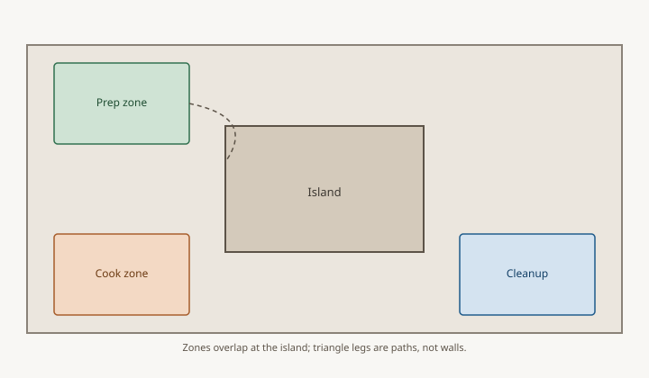

NKBA: no leg of the work triangle should intersect an island
or peninsula by more than 12 inches.

<figure>
  
  <figcaption>When an island sits inside the old triangle legs, zones overlap — the schematic is planning geometry, not a code drawing. Line art: Bradley island design guide (CC0 1.0).</figcaption>
</figure>

That sentence is easy to skip. It is the one that tells you
whether the island is in the work or beside it.

A triangle leg is the walking line from the front center of
the sink to the cooktop, cooktop to fridge, fridge to sink.
If that line has to climb onto the island — if you are
cutting across more than a foot of top to make the trip —
the island is a dam.

I have seen plans where the fridge-to-sink line went
diagonally over a 42-inch-deep island like a highway over a
mall. The designer had preserved the 26-foot sum by drawing
the legs as the crow flies. Crows do not carry casserole
dishes.

Walk it. Stand at the sink. Walk to the range the way a
person walks, around the stools, around the corner of the
stone. Measure that. If a leg goes over 9 feet because you
detoured, the triangle is broken even if the pretty drawing
says 7.

Fixes, in the order I try them:

1. Slide the island off the triangle. Prep zone to the side,
   seating toward the living room, cook wall left alone.
2. Shorten the island so a leg clips a corner by less than
   12 inches instead of crossing the mass.
3. Move an appliance. Sometimes the fridge is the thing in
   the wrong place, not the island.
4. Lose the island. I have done this after cabinets were
   ordered. It is ugly. It is better than a kitchen that
   makes people angry.

Bradley size mods help with (2). Taking 3 inches off a run
is a conversation with the dealer, not a custom-shop delay.
They do not help with a triangle that was never walked.

Put the three appliance front-centers on the plan. Draw the
real walking lines. If a line crosses more than a foot of
island, the plan is not done. I do not care how much the
pendant grouping likes the current rectangle.
