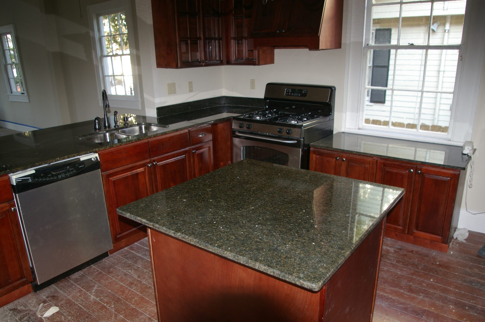

An appliance without landing is a place to burn yourself.

<figure>
  
  <figcaption>Landing zones are empty counter beside heat and water; this island shows finished aisles where landing can actually happen. Photo: MeRyan / <a href="https://commons.wikimedia.org/wiki/File:Kitchen_with_island,_New_Orleans_2007.jpg">CC BY 2.0</a> (Wikimedia Commons).</figcaption>
</figure>

NKBA landings, said in the kitchen language I use with
clients:

- Sink: 24 inches on one side, 18 on the other, same height,
  top at least 16 deep. If the heights split, you still owe
  24 on one side and at least 3 inches of same-height
  frontage on the other.
- Cooktop: 12 on one side, 15 on the other, same height as
  the burners. In an island or peninsula, add 9 inches of
  top behind the cooking surface if that surface is level
  with the rest of the top.
- Fridge: 15 inches on the handle side, or 15 on either side
  of a side-by-side, or 15 no more than 48 inches across
  from the door.
- Microwave: 15 above, below, or on the handle side.
- Oven: 15 next to or above, or 15 across the aisle within
  48 if the door does not block a walkway.

If two landings sit next to each other, take the longer
requirement and add 12. You do not get to count the same
15 inches as both the fridge landing and the cooktop
landing.

Islands get people in trouble because the landings have to
live on the same rectangle as the seating. A cooktop with
proper shoulders and a 9-inch back and two stools is a long
island. A prep sink with 24 and 18 and two stools is a long
island. I would rather put the sink on the wall and keep
the island for prep and people.

The 9 inches behind a cooktop is the one I will not trade.
I have seen a guest set a paper napkin on a grate because
the stone stopped at the back of the burner. The napkin
lost. The guest was lucky.

Ventilation is a landing’s cousin. A cooktop in a Bradley
island needs a hood that ducts, sized to the appliance,
with makeup air if you go over about 400 cfm. A pretty
pendant cluster is not a hood. Recirculating filters are
how open-plan rooms smell like last Tuesday.

When we spec an island appliance, I draw the landings as
shaded blocks on the top view before I draw the stools.
Stools get what is left. If nothing is left, the appliance
or the stools leave the island.
