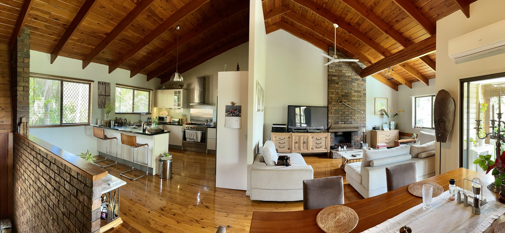

A second cook is not a nicer way to say “someone sitting at
the island talking.” A second cook is a person with a knife
and a pan who needs an aisle.

<figure>
  
  <figcaption>Two-cook kitchens need parallel aisles; open plans still punish a skinny path behind seating. Photo: Kgbo / <a href="https://commons.wikimedia.org/wiki/File:Open_plan_house;_kitchen_and_sitting_room_in_Corinda,_Queensland_01.jpg">CC BY-SA 4.0</a> (Wikimedia Commons).</figcaption>
</figure>

Forty-eight inches between counter frontages. That is the
NKBA number for multiple cooks. I have seen two small,
careful people work in 42. I have seen two normal adults
hate each other in 44. If the household actually cooks as a
pair — not once a year, as a pair — I fight for 48 on the
work sides.

The island can help or it can referee a fight. Help looks
like this: one cook at the wall range, one cook at the
island prep, backs not colliding, landings not shared. Fight
looks like this: both people at the same 36-inch sink run,
island parked 40 inches behind them, dishwasher open.

Assign zones. Say them out loud.

- Cook A: range wall, spices, lids.
- Cook B: island prep, trash, knives.
- Shared: fridge landing, the aisle you both cross.

If you cannot assign zones, you do not have a two-cook
kitchen. You have a one-cook kitchen with an audience. Design
that. It is a respectable kitchen. It is a different aisle.

Door swings become a second-cook problem. A 48-inch aisle
with two 24-inch appliance doors swinging into it is not a
48-inch aisle while those doors are open. I pull dishwasher
and oven doors on the plan. I want 21 inches of standing
room beside a dishwasher at a right angle, per the
guidelines. I want the island corner far enough that a
full-open fridge door does not kiss the stone.

Bradley islands in two-cook rooms should keep the seating on
the non-work side and keep the work side clean: drawers for
tools, no decorative corbels to hip-check, no stool tucked
“just for a minute” on the cook face. If a stool lives on
the work side, you have already given the second cook’s
aisle away.

Ask the pair to cook dinner in the empty room before we
order. Tape the island on the floor. Hand them a pot. If
they laugh, we have the size right. If they apologize to
each other, we redraw.
