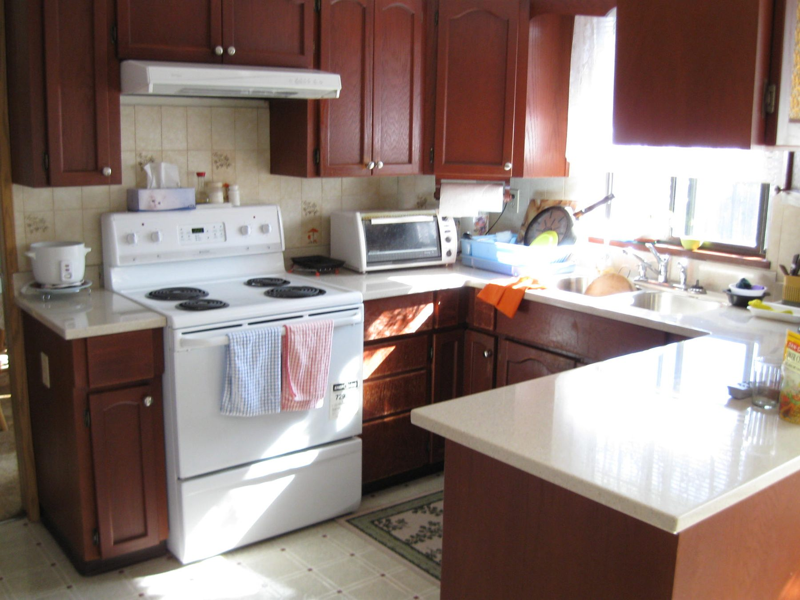

I refuse islands. Not as a personality. As a duty.

<figure>
  
  <figcaption>Some rooms should keep the table and skip the island — tight layouts are easier to read than a forced rectangle. Photo: Korman / <a href="https://commons.wikimedia.org/wiki/File:Humble_kitchen08.jpg">CC BY-SA 3.0</a> (Wikimedia Commons).</figcaption>
</figure>

Refuse when the leftover rectangle after honest aisles is
under 24 inches in one direction and you were hoping for
prep. A cart. A peninsula. A better wall run. Not a stub
that people will hip-check for a decade.

Refuse when the only way to get seating is to put diners in
the work triangle or in the fridge door. Seating is optional.
Cold milk is not.

Refuse when the client wants a cooktop, a sink, a dishwasher,
and four stools in a room that cannot take the landings. That
is not a program. That is a magazine cover. I will not build
the cover.

Refuse when the slab path for power and water is a fantasy.
Some slabs we can core. Some we cannot. An island that needs
a sink and has no legal, sane way to waste and supply is a
piece of furniture, and we should buy furniture.

Refuse when the island is being asked to hide a bad plan.
I have been handed U-kitchens that did not work and told to
“drop an island in to pull it together.” An island does not
pull a bad U together. It adds a fourth problem.

Refuse, or at least pause, when everyone in the meeting is
talking about resale. Resale likes islands the way resale
likes stainless. Resale does not cook in this room on a
Wednesday. If the household does not need the island, do
not spend a year of coffee money to satisfy a future buyer
who may rip it out anyway.

A Bradley dealer can sell a peninsula with the same doors
and the same finish. That is a real alternative, not a
consolation prize. I would rather hand over a kitchen that
walks than an island that photographs.

The refusal is part of the guide because nobody puts it in
the brochure. Write it on the first page of the job if you
have to: *We will not place an island that spends the aisle.*
Then keep the promise when the pretty rectangle shows up.
