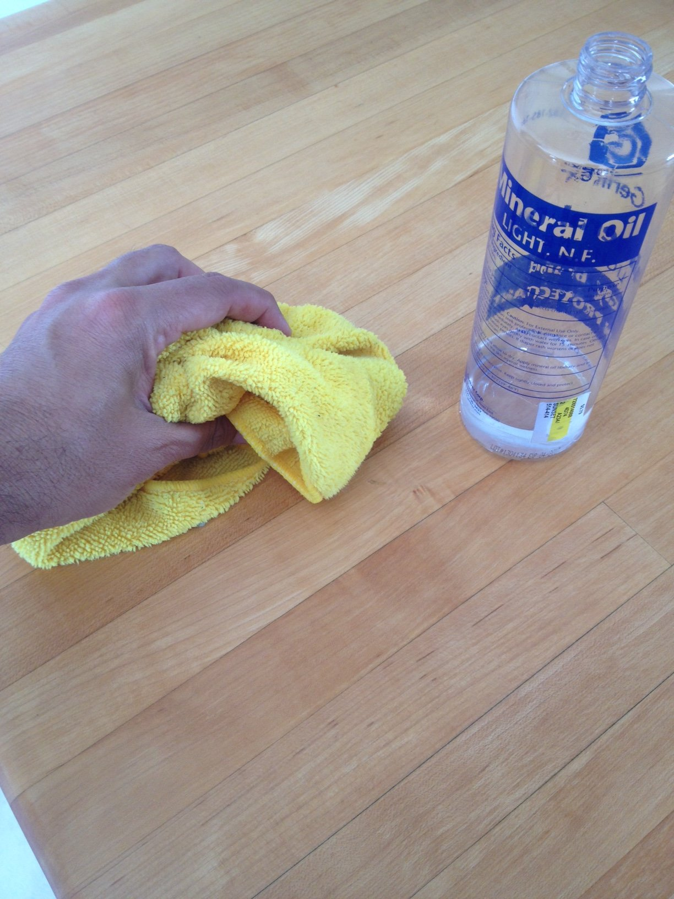

This is not a team sport. It is a job description.

<figure>
  
  <figcaption>Butcher block is a living surface: oil maintenance is part of the material choice, not an optional upgrade. Photo: Timtempleton / <a href="https://commons.wikimedia.org/wiki/File:Mineral_oil_treating_butcher_block.png">CC BY-SA 3.0</a> (Wikimedia Commons).</figcaption>
</figure>

If the island is where you will cut, knead, and drop a hot
pan you were not supposed to drop, wood is in the fight.
If the island is where you will park a wet bag of ice, a
citrus half, and a red-wine glass, stone is in the fight.
If you want both jobs, you want two materials or you want
to lie to yourself twice a week.

Wood — call it butcher block only if the construction
earns the name — is warm, repairable, and louder about
how you live. It dents. It darkens. It takes a plane and
a fresh oil and comes back. It does not like standing
water. It does not like a slow drip from a florist vase.
It will move with the seasons if you let it, and it will
split if you do not.

Stone is the other temperament. Quartz, granite, marble,
soapstone: they stay put. They feel cold at breakfast in
January, which some people love. They will wreck a knife
and they will wreck a dropped glass. Repair is a pro
visit, not a Saturday with mineral oil. Heat tolerance
varies. Marketing blurbs flatten that. I will not.

The honest comparison I give at the island, not in an
email:

- Maintenance: wood wants a habit. Quartz wants a wipe.
  Granite wants a sealer on a calendar. Marble wants you
  to enjoy the etching. Soapstone wants oil and accepts
  the darkening.
- Knives: wood wins. Stone wins only if you always use a
  board, in which case you did not need the stone for
  cutting.
- Heat: soapstone and most granites shrug. Quartz is
  more nervous than the brochure. Wood needs a trivet
  unless you like brands.
- Water: stone, especially quartz and well-sealed
  granite. Wood can live near a sink if the sink is
  detailed like you mean it. I still prefer the sink
  off the wood.
- Weight: stone is a structural event. Wood is a
  furniture event. The Bradley box can take either if
  we plan the rails and the support. We plan them.
- Money: species and slab grade move the number more
  than the category. A thick walnut top can outrun a
  modest quartz. Do not pick a material to “save”
  until you have both quotes.

I do not pick for resale. I pick for the Wednesday. If
the household will not oil wood, I will not sell them
wood and a speech. If the household wants a living
surface and likes objects that age, I will not talk
them into a slab that looks the same at year ten and
year one. Sameness is a feature. It is not the only
feature.

Bradley islands wear both. The box does not care. The
person who wipes the top on Thursday night does.
