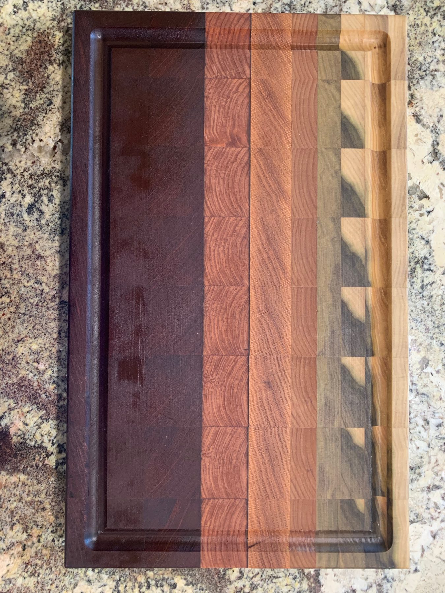

Grain orientation is the difference between a counter
and a block, and between a block and a picture of wood.

<figure>
  
  <figcaption>End-grain tops show their structure: hard species in end grain behave differently under knife marks than edge-grain planks. Photo: Hu Nhu / <a href="https://commons.wikimedia.org/wiki/File:End_grain_cutting_board.jpg">CC BY-SA 4.0</a> (Wikimedia Commons).</figcaption>
</figure>

Edge grain is the residential workhorse. Boards on
edge, long lines running the length of the island,
1.25 to 2.5 inches thick in most shops. It is stable
enough, handsome enough, and you can cut on it if the
finish allows. This is what I spec on most Bradley
islands that want wood.

End grain is the real butcher block. Little squares,
fibers up, a checkerboard. Knives dive between fibers.
It is thicker, heavier, and priced like the labor it
takes. I spec it when someone will actually break down
a chicken on the island and is willing to oil it like
a tool. I do not spec it because a mood board said
“butcher block” and the designer liked the pattern.

Face grain is planks showing the wide face, the look
of a table. Pretty. Softer in the wear path. More
movement. Fine for a film-finished serving island.
Not what I want under a decade of prep.

People use “butcher block” for all three. I stop them.
If we are ordering face-grain walnut with a conversion
varnish, we are ordering a wood countertop. If we are
ordering 3-inch maple end grain with mineral oil, we
are ordering a block. The care card, the fasteners,
and the overhang steel all change with that sentence.

Thickness follows orientation. Edge grain at 1.5
inches is a good top. End grain often wants 2.25 and
up. Face grain can be 1.5 if it is furniture. Seating
overhangs get happier as the top gets thicker, but
thickness is not a substitute for a bracket on a
15-inch stone-style fly. Wood is lighter than stone
and still bends.

Alternate growth-ring orientation when you glue an
edge-grain panel. That is shop talk the fabricator
already knows. What you need to know: a cheap top
that was glued in a hurry will cup. Buy the top from
someone who will still answer the phone in year three.

On a Bradley island I call the grain out on the
purchase order. I do not let “wood top” stand as a
spec. Wood top is how you get face grain when you
paid for edge, and a fight when the photographs go
around the family chat.
