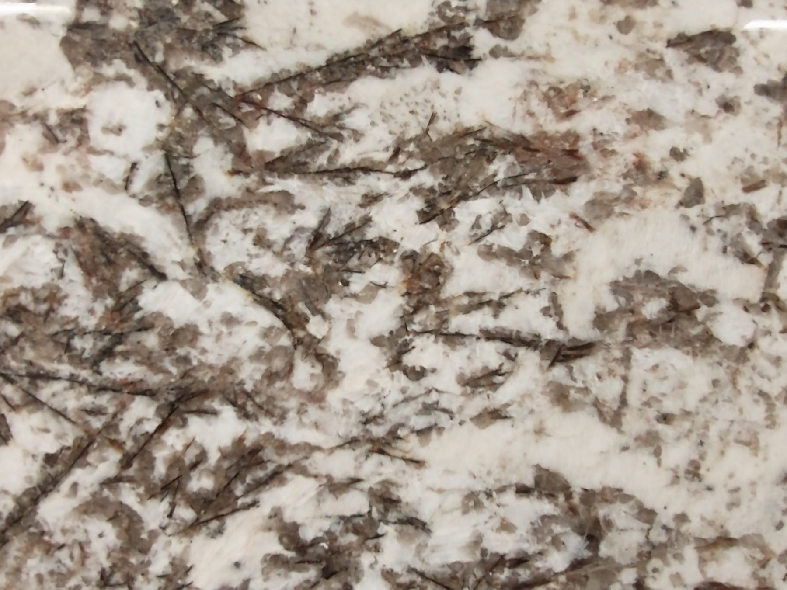

Granite had a twenty-year run as the word for
“nice kitchen.” It earned some of that. It also
earned a lot of busy brown islands that look
like airport floors.

<figure>
  
  <figcaption>Granite brings heat tolerance and natural variation—sealing and slab selection matter as much as the edge profile. Photo: Stilfehler / <a href="https://commons.wikimedia.org/wiki/File:Granite_for_Countertops_12.jpg">CC BY-SA 4.0</a> (Wikimedia Commons).</figcaption>
</figure>

What granite still does better than quartz is
heat, in most cases, and a kind of visual depth
that resin cannot fake. You can set a hot pan
down on many granites and not hold your breath
the way you do with quartz. I still use a
trivet on a good slab because I am not a
performer. The option is there.

Sealing is the honesty test. Some granites are
tight. Some drink oil. The fabricator should
do a water-drop test, not a vibe test. A
sealer on a calendar is a small habit. If a
household will not do it, I steer them to
quartz or to a tight granite we have used
before. “Low maintenance” and “never
maintenance” are different sentences.

Islands show granite’s pattern at a scale walls
do not. A sample the size of a slice of bread
is a rumor. I want a photo of the actual slab,
or I want the client in the yard pointing.
Movement, pits, a garnet that looks like a
bug — those are slab facts. They are not
defects unless we said the stone would be
quiet.

Edges: a 3-centimeter eased edge is the
grown-up default. Ogee on an island was a
time. I will still cut one if the house is
that house. I will not put an ogee on a
modern Bradley slab door and pretend it was
inevitable.

Overhang steel matters more with granite than
with wood because the failure is a crack, not
a bounce. More in the seating drafts. The
short version: do not fly 15 inches of
unsupported granite because a neighbor did
it once.

I still like a quiet granite on a painted
Bradley island. I do not like a loud granite
on a loud granite floor with loud granite
around the cooktop. One surface in the room
gets to speak. The island is a good candidate.
The floor is a bad one to compete with.
