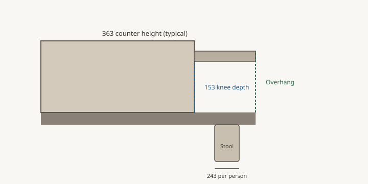

The overhang gets all the love. The space
behind the diner is where the kitchen
keeps or loses its manners.

<figure>
  
  <figcaption>Behind-the-stool clearance (32, 36, or 44 inches) is what keeps diners from blocking the dishwasher or the cook aisle. Schematic: Bradley island design guide (CC0).</figcaption>
</figure>

NKBA, said so I can recite it in a
showroom:

- Nobody walking behind the seated person:
  32 inches from the counter edge to the
  wall or the next object. That 32 is for
  the stool to pull out and a body to sit.
- Someone edging past: 36.
- Someone walking past like a person:
  44.
- Access, someone in a wheelchair passing
  behind: 60, and the knee space depth
  eats into that.

I have watched a 34-inch “walkway” behind
three stools become a shuffle at every
party. The stools stay pulled out because
people are eating. The walkway you drew
does not exist while the island is doing
its seating job. Design for the stools
in use, not for the stools pushed in for
the photographer.

If the living room is behind the island,
the 32 can be enough — the diner’s back
is the room. If a pantry door is behind
the island, I want 44 and I want the door
swing drawn. A door that taps a back
every time someone wants cereal will get
the island blamed.

Rugs behind stools are how glasses die.
A stool leg catches. The diner hops. The
wine does not. If a rug must live there,
it should be flat and it should stop
before the stool travel. I prefer a
finished floor and a washable runner
elsewhere.

Do not steal this clearance to grow the
island. Growing the island is the instinct
when a plan feels empty. Empty behind the
stools is not empty. It is the path.

I write 32 / 36 / 44 on the seating side
of every Bradley plan and I circle the
one we are claiming. If we cannot claim
36 and the household walks that path to
the back door, we lose a stool or we lose
the island depth. We do not invent a
fourth number that feels lucky.

Holiday test: tape the stools out, set
four place settings, and walk a platter
from the range to the table. If you
turn sideways and laugh, the clearance
is a party clearance, not a daily one.
Daily is the one I will sign. Parties
can borrow the living room.
