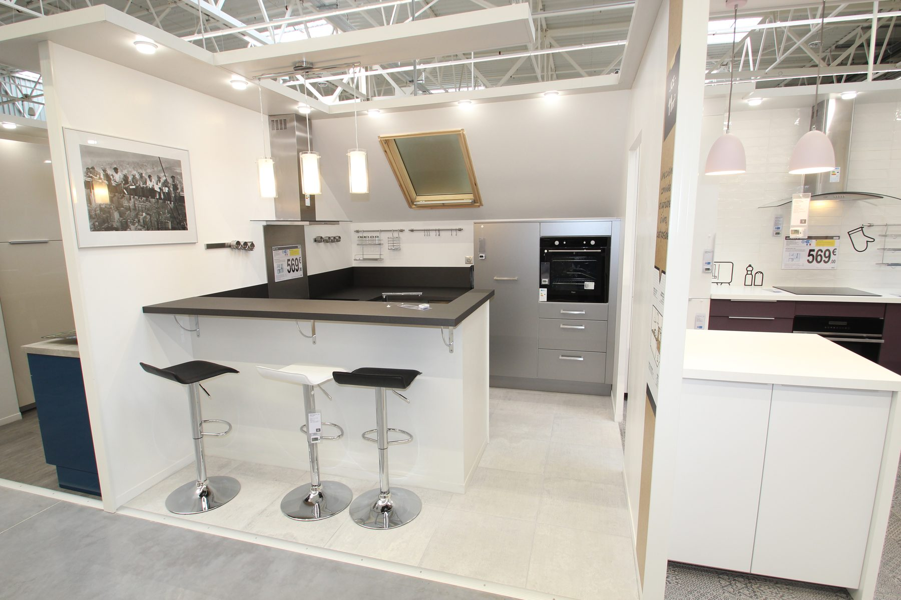

The gap is the comfort people cannot
name. They say the island feels “off.”
They mean their thighs.

<figure>
  
  <figcaption>Stool height gap: match seat height to top—about 24-inch seats at 36-inch counters, with 10–12 inches of leg room to the underside. Photo: Lionel Allorge / <a href="https://commons.wikimedia.org/wiki/File:Castorama_aux_Ulis_le_19_avril_2017_-_47.jpg">CC BY-SA 3.0</a> (Wikimedia Commons).</figcaption>
</figure>

A useful rule: about 10 to 12 inches
between the top of the seat and the
underside of the top. Counter-height
tops at 36 want a seat around 24 to
26. Bar-height tops at 42 want a seat
around 30 to 32. Table-height at 30
wants a chair, 18-ish, like a dining
room.

Stools that are “24-inch” on a website
are sometimes 24 to the seat and
sometimes 24 to a stretch of chrome.
Measure the one in the cart. I have
been burned by a seat that was 22
under a 36-inch top. Everyone sat
forward like they were leaving.

Footrests matter more than backs for
a 36-inch perch. A stool without a
place for a foot turns a 20-minute
coffee into a fidget. If the Bradley
island has a recessed toe on the
seating side, that can be the
footrest. If the seating side is a
flat furniture panel, the stool has
to bring its own rail.

Backs: I like them for people who
will sit through a meal. I dislike
them when the stools have to tuck
under a 15-inch overhang and the
backs hit the box. Measure tuck-in.
If the stools cannot park without
blocking the 36-inch walkway, we
picked the wrong stools or the
wrong overhang.

Swivels are friendly and they eat
width. A swiveling diner occupies
more than 24 inches of air. Fine
for two seats. Crowded for four.

Do not buy the stools in a different
decade from the island. I want them
chosen before the overhang is locked,
because a thick seat cushion changes
the gap and a thick tail changes the
tuck. The island is a chair-and-table
problem. We pretend it is only a
cabinet problem, and then we order
cabinets.

Bring one stool to the house before
the top is glued down. Sit. Put a
board at the finished height on
painter’s buckets if you have to.
If your knees kiss the underside,
we change the stool or we change
the fly. Doing that after the stone
is set is how you buy a second set
of stools and keep the first in the
garage “for guests.” Guests get the
good ones. You know that.
