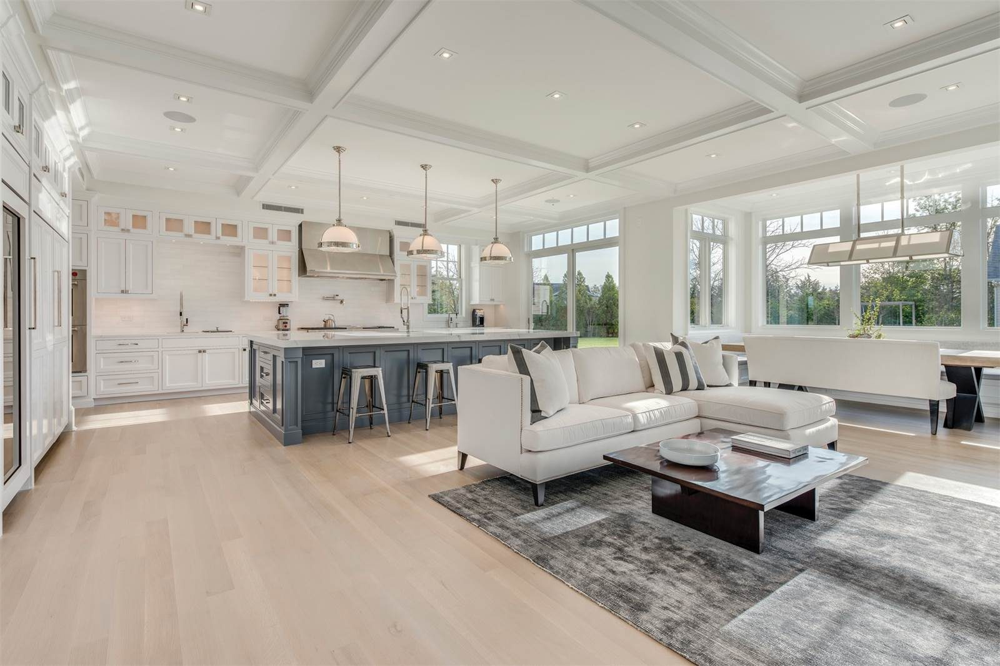

Pendants are not a lighting plan.
They are a jewelry decision that
sometimes lights a roast.

<figure>
  
  <figcaption>Light over the island needs a layer plan—pendants or slots centered on the work surface, not the room centroid. Photo: JessofWoodnCo / <a href="https://commons.wikimedia.org/wiki/File:Hamptons_Kitchen_Design_1.jpg">CC BY-SA 4.0</a> (Wikimedia Commons).</figcaption>
</figure>

I want two layers over a Bradley
island. One is the work light: even,
high enough CRI that you can tell
chicken from the board, no cave
under a person’s hands. That can be
a linear pendant, a recessed pair,
or a strip in a hood. The other is
the room light: something that does
not make the living room look like
a tavern when the work lights are
off.

Three little globes in a row are
what clients ask for. They can
work if the island is short and
the globes are actually bright.
They fail on an 8-foot island
because the middle third goes
dim and the stools get glare. A
single linear, or two larger
pendants, often behaves better.
I will still hang three if the
house is the three-globe house.

Height: start around 30 to 36
inches above the top and then
look at the view from the sofa
and from the person who is 6
foot 3. There is no sacred
number. There is a number that
keeps a forehead safe and the
light on the work.

Dimmers on the jewelry. A simple
switch on the work light if you
want. I like them on two circuits
so a homework night is not a
stage set.

Under the seating overhang, a
soft LED can keep faces from
going hollow. Keep it out of
eyes on the sofa. Keep the
driver accessible. A dead strip
inside a closed box is a future
resentment.

Do not let pendants become the
hood. If there is a cooktop, there
is a hood, and the hood is the
light’s boss over that zone.

Center the lighting on the island
that exists, not on the room’s
centerline, unless they happily
match. I have seen a beautiful
linear hung on the room axis
while the island sat 8 inches
off because of a soffit. It
looked drunk. Measure both.

The electrician and the plumber
and the hood guy all want the
ceiling. Draw the island ceiling
as a small plan of its own:
hood duct, junction, boxes for
pendants, a spare. The spare is
how you add a holiday fixture
without opening plaster.
