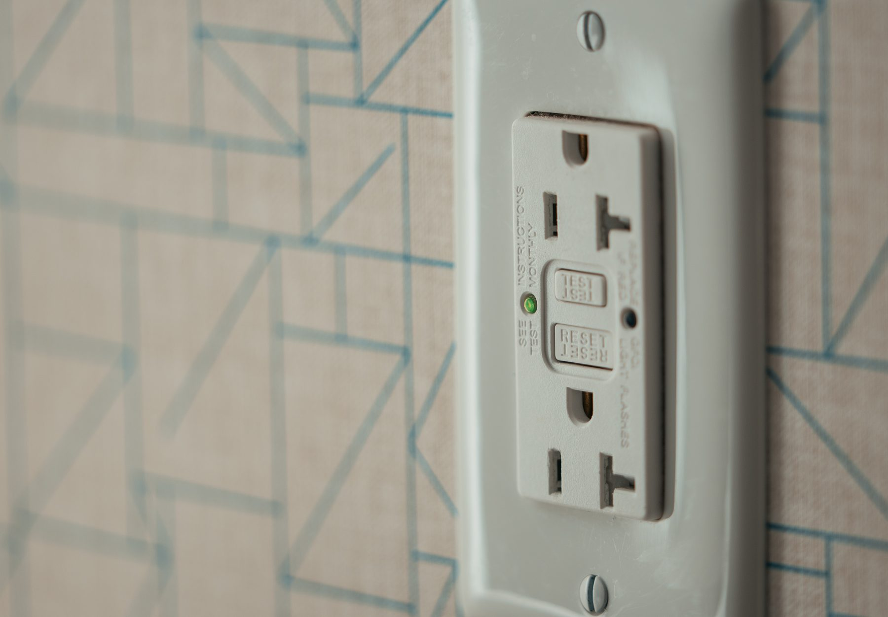

The island became a charging station
because that is where the backpack
lands. Code did not make that job
illegal. It made the toaster-on-a-
side-outlet job illegal as counter
service.

<figure>
  
  <figcaption>USB ports belong in the electrical plan with GFCI protection — outlets are code objects, not drawer accessories. Photo: Tony Webster / <a href="https://commons.wikimedia.org/wiki/File:Ground_Fault_Circuit_Interrupter_(GFCI)_Electrical_Outlet_(29268945818).jpg">CC BY 2.0</a> (Wikimedia Commons).</figcaption>
</figure>

USB-only devices, without a 125-volt
slot, are the loophole I will use
carefully. They can live on the
homework face of a Bradley box,
below the top, where a kid can
reach a phone and cannot plug a
griddle. Confirm the edition and
the listing. Do not invent a
device that is “basically USB”
and also has two tired sockets.

What belongs below the top:

- Charging, if we chose USB-only
  and the inspector agrees.
- A vacuum catch, if the house is
  that house.
- Lighting drivers, accessible.
- The future-provision junction,
  accessible, covered, not under
  a pile of takeout menus.

What does not belong below the top
if you are claiming it serves the
work surface:

- The toaster outlet.
- The kettle.
- The portable induction hob.
- A power strip taped to a rail.

Cords that come from the wall
across a 42-inch aisle belong in
the 1998 failure draft. If the
household will run them anyway, we
failed the provision or the pop-up.

I like a small charging drawer:
listed, ventilated a little,
GFCI-thinking upstream, a place
for three cables and not a blender.
Drawers full of power are a fire
story if you fill them like a
junk drawer. We label the inside
of the drawer. We mean it.

Phones also die from water. A
charging face next to a prep sink
is a bad neighborhood. Put the
USB on the seating end, dry,
away from the board.

Bradley furniture backs photograph
better without a row of USB
smiles. I will still cut a pair
if the household lives on those
ports. A clean panel that forces
a wall-cord is not cleanliness.
It is a dare.

One more below-the-top object I
allow: a listed receptacle inside
a closed appliance garage that is
not claiming to serve the island
top — a docking spot for a vacuum
or a mixer that lives there. The
door is the tell. If the door is
open and a toaster is out on the
wood, we are back in the old
habit. Write the intended use on
the inside of the door. People
rise to a sentence they can see.
