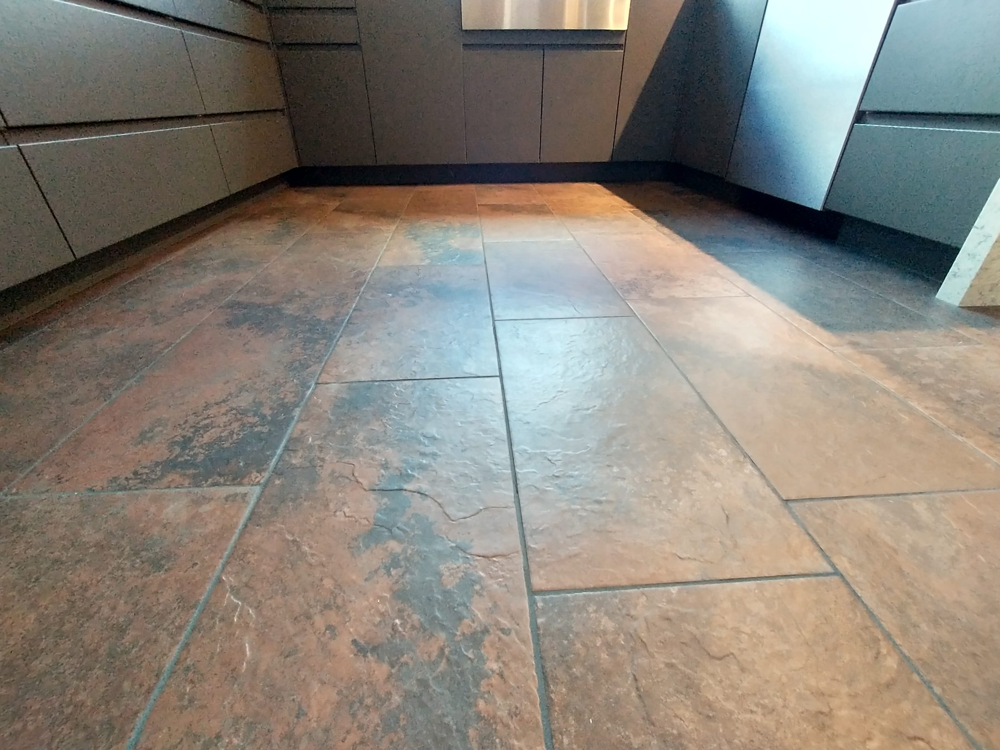

Full-access is the reason a Bradley
island feels bigger than a face-frame
island of the same outside measure.

<figure>
  
  <figcaption>Full-access frameless boxes are the island’s skeleton—wider drawers and adjustable legs show up before the top is templated. Photo: Stilfehler / <a href="https://commons.wikimedia.org/wiki/File:F%C3%B6rb%C3%A4ttra_Toe_Kick_U-Kitchen.jpg">CC BY-SA 4.0</a> (Wikimedia Commons).</figcaption>
</figure>

There is no rail of wood around every
opening. The drawer is the opening.
On an island, where every inch of
width is an argument with an aisle,
that extra width is not a slogan. It
is a mixer that goes in facing
forward. It is a stack of bowls that
does not need a sideways dance.

The box itself is a 3/4-inch story in
the current book: ends, tops, bottoms,
shelves. Confirm the material —
furniture board with a plywood
upgrade, or plywood as the day’s
spec. I care more about a real stretcher
under stone than I care about winning
a plywood religion fight, but I will
not spec a thin back on a seating
face that has to take brackets.

Hardware is the quiet half of
full-access. Soft-close, full-
extension, six-way hinges. These
used to be the upgrades that padded
a quote. Here they are the floor.
An island drawer that slams is an
island that announces every late
snack to the sofa. Soft-close is
not luxury in an open room. It is
manners.

Size modifications are how we honor
the tape. A 1-inch reduction in
depth to keep a 42-inch aisle is a
dealer conversation, not a custom-
shop delay. I would rather shrink
a box than shrink an aisle. The
whole point of a line that will
cut to the inch is that the room
wins.

What full-access will not do:

- Invent floor that is not there.
- Make a 30-inch walkway into a
  48-inch work aisle.
- Hold a waterfall with a shrug.

Finished ends are not optional on
an island. Four sides show, or
three sides and a seating fly.
I spec the end panels and the
seating back as furniture, same
finish, same care. A raw box side
toward the dining table is a
tell.

Confirm the collection, the door,
and the color with the current
dealer book. I will not freeze a
finish name in this guide. I will
freeze the idea: the box is a
full-access carcass, sized to the
room, dressed on every face people
can see. That is a Bradley island
before it is a top.
