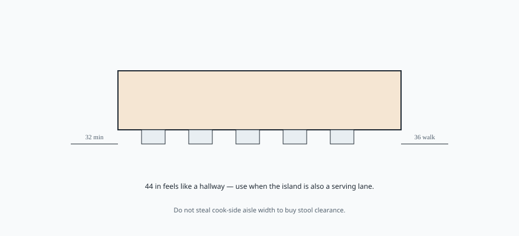

# Embed — behind-the-stool

```html
<figure class="bradley-figure bradley-figure--diagram">
  
  <figcaption>
    Stool clearance behind the island is a traffic lane, not leftover space — plan 36 inches to walk comfortably and 44 when the island doubles as a serving route.
    <span class="figure-credit">Bradley kitchen island guide — editorial schematic.</span>
  </figcaption>
</figure>
```
