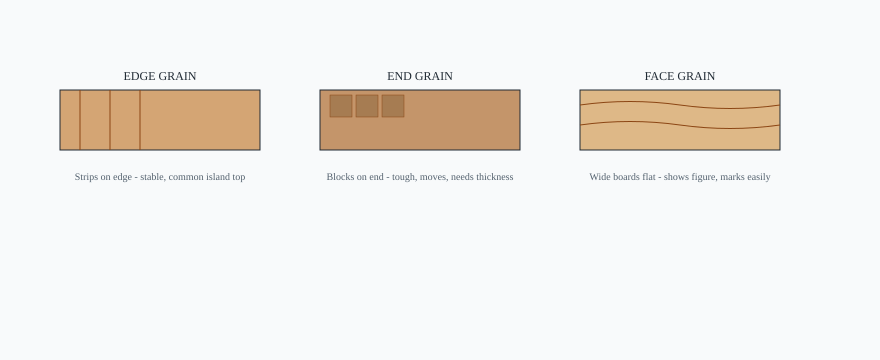

# Embed — edge-end-face-grain

```html
<figure class="bradley-figure bradley-figure--diagram">
  
  <figcaption>
    Grain direction drives stability, knife marks, and thickness — edge grain for most island tops, end grain when you mean serious chopping, face grain when you want figure and accept maintenance.
    <span class="figure-credit">Bradley kitchen island guide — editorial schematic.</span>
  </figcaption>
</figure>
```
