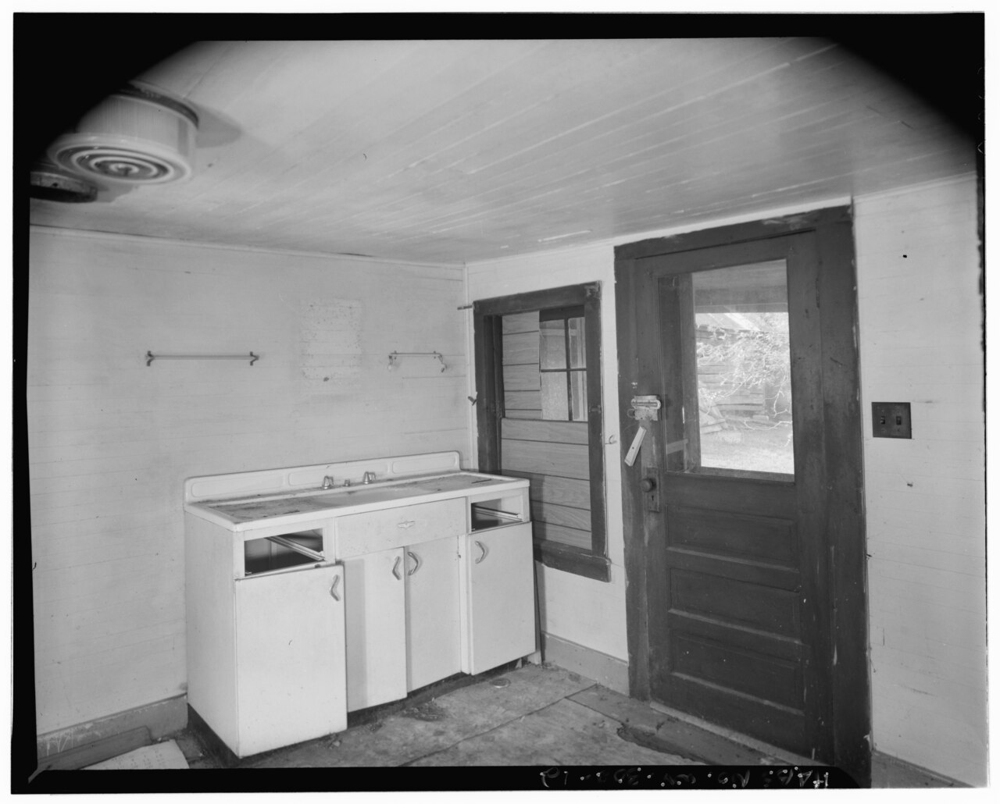

# Embed — farm-table-that-never-left

```html
<figure class="bradley-figure bradley-figure--photo">
  
  <figcaption>
    Before “island” was a renovation keyword, the middle of the room held a work table you could walk around — the same job a sized cabinet island does today.
    <span class="figure-credit">HABS, National Park Service (public domain), Trump–Lilly Farm, West Virginia.</span>
  </figcaption>
</figure>
```
