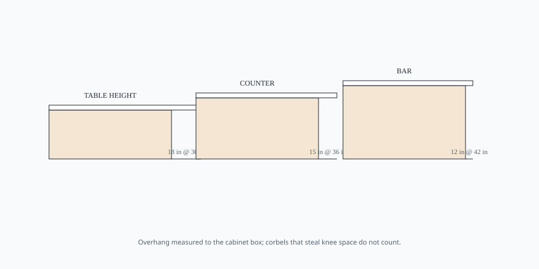

# Embed — overhang-by-height

```html
<figure class="bradley-figure bradley-figure--diagram">
  
  <figcaption>
    Overhang is knee space, not decoration — NKBA seating depths shrink as the top rises, and corbels that steal those inches do not count on the spec sheet.
    <span class="figure-credit">Bradley kitchen island guide — editorial schematic.</span>
  </figcaption>
</figure>
```
