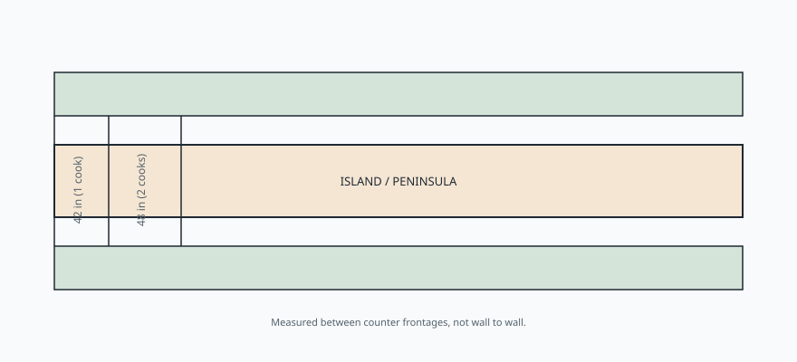

# Embed — the-aisle-is-the-island

```html
<figure class="bradley-figure bradley-figure--diagram">
  
  <figcaption>
    You are buying aisle width, not countertop square footage — NKBA planning targets are the difference between cooking and shuffling in a tight kitchen island layout.
    <span class="figure-credit">Bradley kitchen island guide — NKBA-style reference, not an NKBA document.</span>
  </figcaption>
</figure>
```
