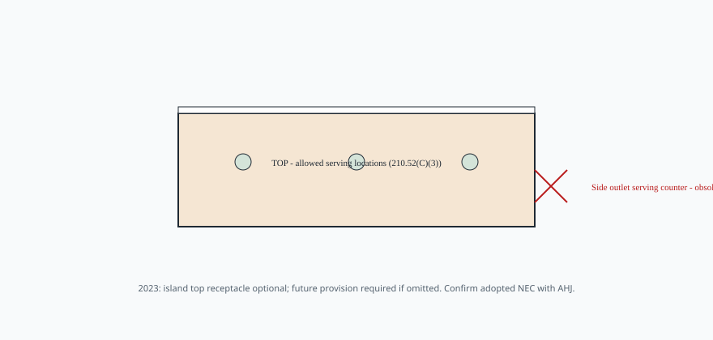

# Embed — what-2023-nec-changed

```html
<figure class="bradley-figure bradley-figure--diagram">
  
  <figcaption>
    NEC 2023 tightened where an island receptacle may serve the top — side outlets under stone are legacy practice; optional outlets now require future provision if you skip them.
    <span class="figure-credit">Bradley kitchen island guide — paraphrase for conversation with your electrician and AHJ, not a permit drawing.</span>
  </figcaption>
</figure>
```
