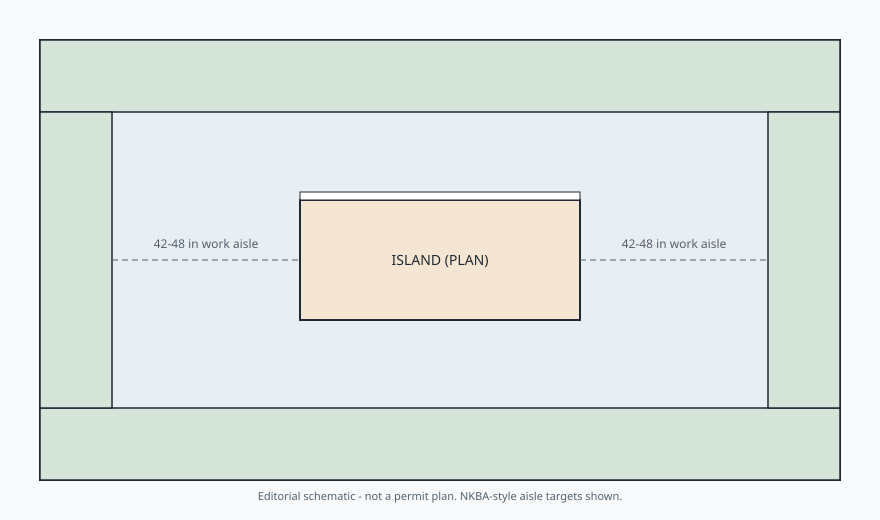

# Embed — why-this-guide

```html
<figure class="bradley-figure bradley-figure--diagram">
  
  <figcaption>
    A Bradley island only fits after honest aisle math: plan the air around the box first, then size the island that remains.
    <span class="figure-credit">Bradley kitchen island guide — editorial schematic.</span>
  </figcaption>
</figure>
```
