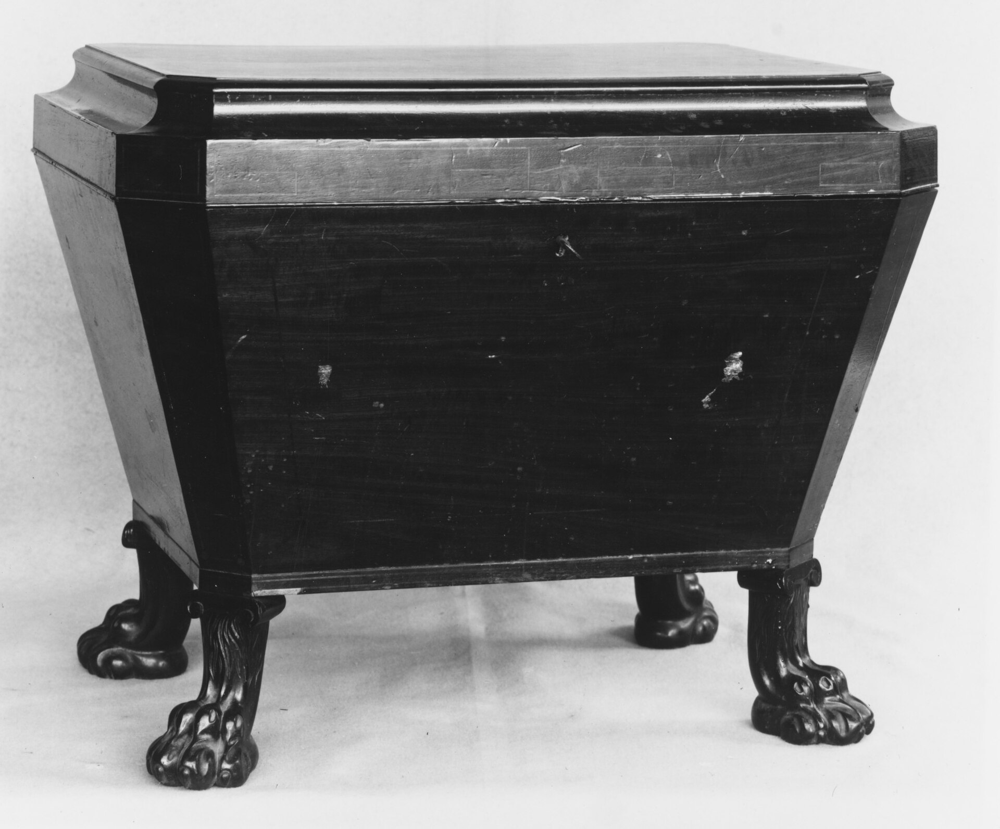

<figure>
  
  <figcaption>The cellarette brought the cellar upstairs: a little box with rings for servants and partitions for bottles. Metropolitan Museum of Art / <a href="https://creativecommons.org/publicdomain/zero/1.0/">CC0</a> (Wikimedia Commons).</figcaption>
</figure>

Cellarette. Little cellar. That is not poetry. That is a job description from a house that still had a real cellar, and a dining room that had grown tired of using it in the middle of a course.

In the middle of the 1700s, in England first and then anywhere London fashion could ride a crate, a new piece of furniture learned to hold bottles in the room where they would be poured. Not in the ground. Not in a pantry twenty steps away. In the dining room, near the sideboard, sometimes literally in the opening under the sideboard's waist, sometimes on casters so a servant — or, later, a host who had dismissed the servants — could roll the evening to the table.

The Met will tell you that about a New York cellaret from 1810 to 1820. Essential with the sideboard. Wheeled up for the meal. I like that label because it refuses the lifestyle reading. This is not "entertaining." This is logistics. Wine is heavy. Stairs are long. Conversation is a timing problem. The cellarette is the answer a cabinetmaker could sell.

Before the lidded case there was the open cistern — a cooler, a tub with manners, wood on the outside, metal or stone on the inside, cold water or ice or snow against the glass. The cellarette puts a lid on that idea. The lid is not only weather. The lid is a lock, or the place a lock can live. Wine in a fashionable house was money. Money gets a key.

If you have stood in a dining room that still has a sideboard with a hole in the middle that looks like a missing tooth, you have seen the ghost of the form. The tooth was the cellarette. Museums put it back. Houses that got modernized turned the hole into a place for a dog bed or a speaker. I am not joking. I have seen both.

What did it hold. Bottles, first. Sometimes partitions so the bottles did not argue. Sometimes just a lined well. The American and English ones we can point to are mahogany more often than not, because mahogany was the dining-room wood of that world. Boston will give you rosewood and brass stringing. Charleston will give you a regional accent I am not going to fake from a catalog. The point is not the veneer. The point is that the dining room had become a performance space, and the performance needed a prop that was also a tool.

I make casegoods in Ferdinand. I do not make 1810. I do make the cousin: a lidded box that has to take weight, take a finish, and not rack when you roll it. Casters are not decoration. Casters are a decision about floors. A cellarette that looks right on a rug and chatters on a board floor has failed the little-cellar job.

People ask me for a "wine chest" and send a picture of a cellarette and a picture of a credenza and a picture of a fridge. I send them back to the three objects. If they want the little cellar, I want to know: does it roll. Does it sit under something. Does it open from the top, which is the old way, or from the front, which is the cabinet way pretending to be old. A top-opening case is a different hinge and a different conversation with a table apron. You cannot stand a top-lid case under a sideboard that already has a drawer in its mouth.

The cellarette also taught a habit we still have and do not name. It taught the dining room to keep the drink in the room without making the room a tavern. No rail. No mirror. No stools. A box. A lid. A roll to the table. If your new "bar" is trying to be a tavern in a dining room that still wants to be a dining room, you are fighting the oldest successful version of the object.

I will not sell you a reproduction with a fake crest. I will tell you the machine. Little cellar. Upstairs. Moveable. Next to the sideboard. Built because stairs and servants and money and ice all had to meet in one hour.

That is the first ancestor. Everything after — the fitted sideboard, the cocktail cabinet, the rec-room wet bar — is a fight about whether the bottles still get to be a piece of furniture, or whether they have to become a piece of the house.

Next we open the lid and talk about the metal. The pretty wood is the lie the dining room told visitors. The liner is what the bottles actually lived in.
