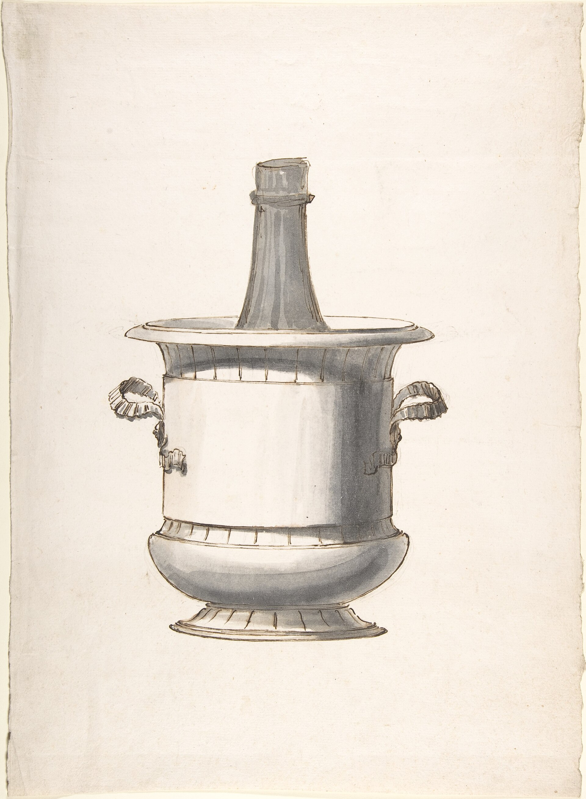

<figure>
  
  <figcaption>The sarcophagus and urn silhouettes dressed utility as antiquity—fashion, not a secret code. Metropolitan Museum of Art / <a href="https://creativecommons.org/publicdomain/zero/1.0/">CC0</a> (Wikimedia Commons).</figcaption>
</figure>

Sheraton says it in shop English. The cellaret is often a sarcophagus: "an imitation of the figure of ancient stone coffins." He is not being gothic for Halloween. He is being fashionable. Around 1800, if you wanted an object to look expensive and educated, you made it look like it had already been dead for a thousand years.

The dining room had already borrowed Rome for its pedestals. It borrowed Egypt after Napoleon stumbled through the place and the pattern books followed. George Smith's 1808 collection gives you coolers that are hip baths and coolers that are graves. Rams' heads. Acroteria — the little horns on the corners. Fluted feet that Piranesi would have recognized as belonging to an altar. Sydney Living Museums will walk you through a mahogany case with ebonized rams and tell you it would sit fine in a mausoleum. They are not wrong. They are also not being mystical. The grave is a style.

I like saying that out loud because people attach a story. They want the sarcophagus cellarette to be a memento mori, a wink about drink and death, a dark joke the host told with a key. Sometimes a host had a sense of humor. Most of the time a host had a copy of a plate and a cabinetmaker who could carve a lion's paw. The meaning is "I can afford antiquity." The job is still bottles.

The form has shop consequences.

A sarcophagus is wider at the shoulder than a simple chest. It has a lid that is a roof, not a flat. The lid wants a thumb-mold and a weight. If you put bottles in a tapering well, the partitions have to follow the taper or the bottles lean like bad teeth. Leaning bottles look drunk in a way that is not charming when the lid comes up at a dinner.

The feet are often paws or dolphins. Sheraton wants the rings and the heads cast in brass and lacquered. He wants you to be able to move the coffin. A heavy, lined, ice-ready box on carved paws is a freight problem. I have moved Empire pieces that were designed by a person who did not have to get them through a Federal doorway. Measure the doorway. Measure the stair. The grave does not levitate.

In a modern dining room the sarcophagus is a bully. It reads as a coffee table that forgot to be low, or as a toy chest for a boy who collects swords. If you want one, I need to know the chair height, the sideboard height, and whether anyone will walk the path between table and wall in the dark. Corners at shin height are how you get a lawsuit and a story. The old rooms had more servants and fewer shins in jeans.

Egyptian Revival is a cousin, not a twin. It can be a cooler that looks like a bath. It can be a case with cavetto cornices stolen from a temple. It is loud. Loud can be right in a room that is already loud. It is wrong in a quiet Shaker-minded dining room that wants "a little wine storage." Say the loudness before we draw. I can do quiet. I can do a grave. I cannot do a quiet grave that also photographs like a museum and also tucks under a slim console. Those are three pieces.

What I will steal from the sarcophagus, if we are not building a costume, is the lid. A lid is a different hospitality than a pair of doors. You open a lid and the room looks down into the bottles. It is a well. It is communal. Doors are a closet. Both are fine. They are not the same gesture at a table. If you want people to gather, a lid in the right place is an old trick that still works. If you want the bottles to disappear, doors. If you want both, you want two objects, not one object with a personality disorder.

Do not ask me to put a skull inlay on a lid and call it Regency. Regency had enough going on without a tattoo.

The liner still sits inside the grave. Ice still wants out. The pretty paws still have to sit on a pad if the floor is radiant and hot. Antiquity does not exempt you from physics. That is the educational point. The coffin is a silhouette. The job is a wet, heavy box.

Next, the lock. Why the dining room kept a key on the wine, and why a lock on a new cabinet is not a personality — it is a decision about children, cleaners, and the cost of a bottle.
