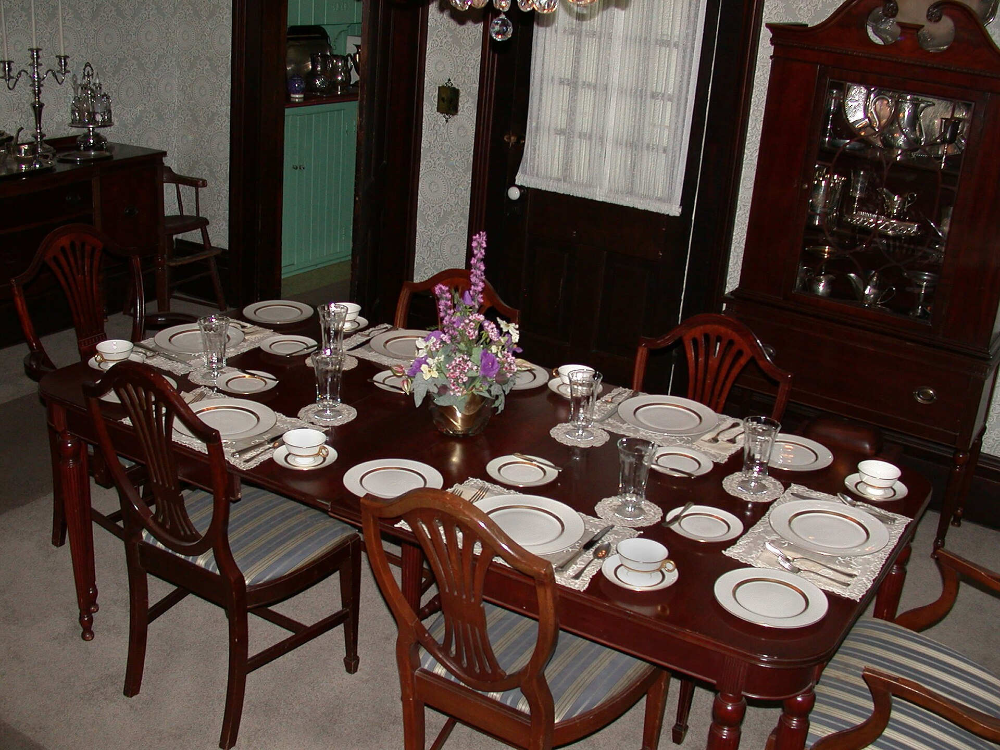

<figure>
  
  <figcaption>The nineteenth-century dining room performed wealth—the sideboard and cooler are part of the set. National Park Service / <a href="https://commons.wikimedia.org/wiki/File:The_Dining_Room_at_219_North_Delaware_Street,_Another_View_(a12f94fc-1474-4d8e-bffb-de52f25bbd26).jpg">public domain</a> (Wikimedia Commons).</figcaption>
</figure>

The English cellarette came to America in a crate, and then America did what it does. It made the dining room larger and asked the furniture to prove the room.

In the early 1800s a fashionable American house is learning a new kind of dinner. Not just feeding people. Showing that you can feed people in a room that has been given to that purpose. Historians will talk about the dining room as a performance space. I will talk about it as a room that suddenly needed a lot of mahogany in one view: table, sideboard, cellarette, maybe knife boxes, maybe an urn that had never seen a butler.

Henry Sargent's Boston picture is waiting in the next episode. Before we look at it, I want the room. Wall-to-wall carpet. Heavy curtains. A crumb cloth under the table so the carpet survives the roast. Busts over doors. Silver out. Wine out. The men stay after; the painting is a gentlemen's dinner. Historic New England used that picture when they put the Otis House dining room back together, which tells you the painting is evidence, not nostalgia.

Why does a shop in Ferdinand care.

Because the American bar, the American liquor cabinet, the American built-in — they all inherit this idea that drink furniture is how a room proves it is a room. We never quite got over it. The 1950s rec room is a dining-room performance that moved downstairs and took off its coat. The 1970s paneled den is the same performance in darker stain. The open-plan kitchen bar is the performance that fired the dining room and kept the bottles.

Federal and Empire sideboards in New York — Phyfe's world, Lannuier's world — are not shy. They are stages. Pedestal ends. Columns. Brass. A place for the cellarette to dock. The bottles are part of the architecture of the meal. If you have ever stood in a period dining room and felt like you should not put your backpack on the floor, that is the performance still working.

There is a class fact I will not dance around. These pieces are not how most Americans stored whiskey. Most Americans stored whiskey the way they stored flour: in a crock, in a cupboard, in a box that did not have a Greek key. The furniture history is a history of the houses that could afford a dining room as a separate idea. That does not make the history fake. It makes it specific. When a catalog today sells "the Federal liquor cabinet" to a condo, it is selling a memory of a class performance. You can want the memory. You should know it is a memory.

Regional shops made regional coolers. Boston will give you rosewood and stringing. New York will give you mahogany and a wheel to the table. Charleston will give you a climate that fights veneer and a dining culture that took wine seriously in the heat. I am not going to invent a Charleston maker. I will say the form traveled and picked up an accent.

The performance also changed who poured. In a staffed house the cellarette lets the host dismiss the servants without dismissing the wine. That sentence shows up in the antique literature and it is a social machine. Privacy. Male company. A key. In a house without servants — which is most of our houses — the same object is just a box you do not want to walk to the kitchen from. The object survived the staff. The meaning thinned.

I make dining tables. I have sat through the conversation about whether a house still needs a dining room. I will not settle it. I will say this: if you kill the dining room and keep the performance, the performance will land on a kitchen island or a built-in in the living room. The bottles will still need a case. The case will still need to decide if it is furniture or wall. The American habit of proving hospitality with wood did not die. It changed zip codes.

If you want a quiet American piece, we can do a sideboard that holds bottles without acting. No columns. No paw feet. No lock unless you need a lock. The performance is optional. The measurements are not.

Next we look at the picture that froze the performance long enough for a museum to hang it: Sargent's *Dinner Party*, about 1821, and the cooler in the corner that is not a mystery once you have been in this series for ten minutes.
