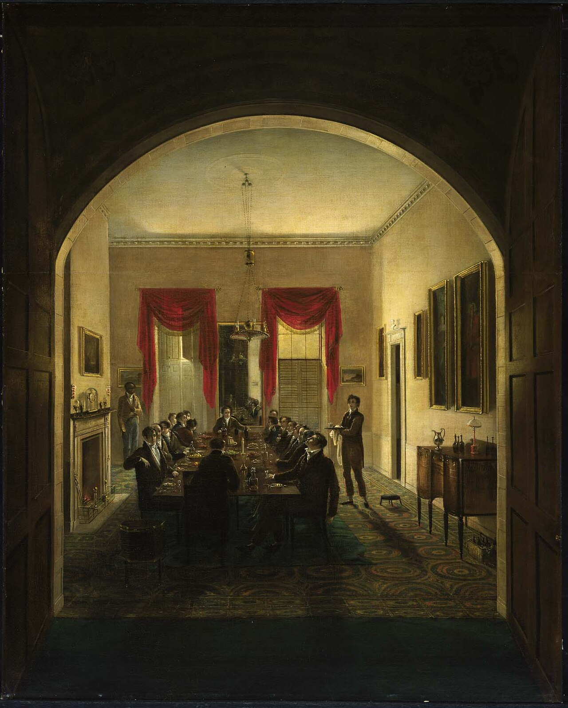

<figure>
  
  <figcaption>Sargent’s 1821 <em>Dinner Party</em> (MFA Boston acc. 19.13) keeps the cellarette at work—not as decoration. Henry Sargent / <a href="https://commons.wikimedia.org/wiki/File:Henry_Sargent_-_The_Dinner_Party_-_19.13_-_Museum_of_Fine_Arts.jpg">public domain</a> (Wikimedia Commons).</figcaption>
</figure>

Go to the Museum of Fine Arts in Boston, or go to the page if you cannot go to the room. Henry Sargent, *The Dinner Party*, about 1821. Accession 19.13. Oil on canvas, about five feet tall. Gift of Mrs. Horatio Appleton Lamb in memory of Mr. and Mrs. Winthrop Sargent. I am giving you the label so we do not treat the picture like a mood board.

It is a gentlemen's dinner. The table is still in the fruit-and-nut end of the night. There is wine. There is a candle for cigars if you read it that way. And down at the table, in the front left if you are standing where the painter stood, there is a cellarette. A wine cooler. A little cellar that has come all the way up to the cloth.

People who do not make furniture squint at it. I have read a food-history blog that asked whether the object on the floor by the sideboard was a stool or a heater. That is a fair squint if you have never been paid to build a box that lives there. Once you have, the object stops being a mystery. It is the machine we have been talking about. The MFA even has a Boston cooler of the same years — rosewood, lead lining, a patent lock — sitting in the collection as the type.

Why a painting.

Because furniture leaves. Houses change. Sideboards get cut down to fit an apartment. Cellarettes become coffee tables, or planters, or the thing in the antiques mall with a fern. A painting from a man who was in the room keeps the object at work. Sargent is not advertising a shop. He is showing a class how it looks to itself. The cooler is in the shot because the cooler was in the life.

Historic New England has said out loud that they used this picture when they restored the Otis House dining room. Curtains. Carpet. Crumb cloth. Busts. Table set like the painting. That is how seriously the picture is taken as evidence. I take it that seriously for a different reason. I want you to see that the drink furniture is not against the wall posing. It is at the table. It has a job in the hour.

If I am drawing a piece for a dining room now, I ask: does this object work during the meal, or only in the photograph before the guests arrive. A cabinet that is ten feet behind the host's chair is a storage piece. A piece that can be reached without a speech is a serving piece. The Sargent cooler is a serving piece. Most "liquor cabinets" I am sent are storage pieces wearing serving-piece language.

Boston in 1821 is not Ferdinand in 1999. I will not pretend I grew up under those busts. I grew up under a carpenter's ceiling. The useful transplant is the placement. Put the bottles where the evening actually happens, or admit you put them where the wall was empty.

Look at the rest of the picture while you are there. The room is crowded with proof: carpet, cloth, glass, the architecture of having enough. The cooler is a small dark shape in all that proof. That is also educational. The best drink furniture in a dining room is not the loudest object. The table is the loudest object. The cooler is a tool. When a modern bar becomes the loudest object in a dining room, the dining room has lost the argument Sargent's room was still winning.

I will not hang a reproduction of this painting over a new cabinet and call it provenance. I will steal the one fact I can defend. In a serious American dining room of that year, the wine box was close enough to the table to be in the painting.

If you cannot get to Boston, get the object number and look until you can point at the cooler without the caption. That pointing is the whole episode. After you can point, you will stop calling every dark box in a dining room a mystery.

Next, the map: New York on wheels, Boston in rosewood, Charleston in the heat — same job, different shops, and no invented makers.
