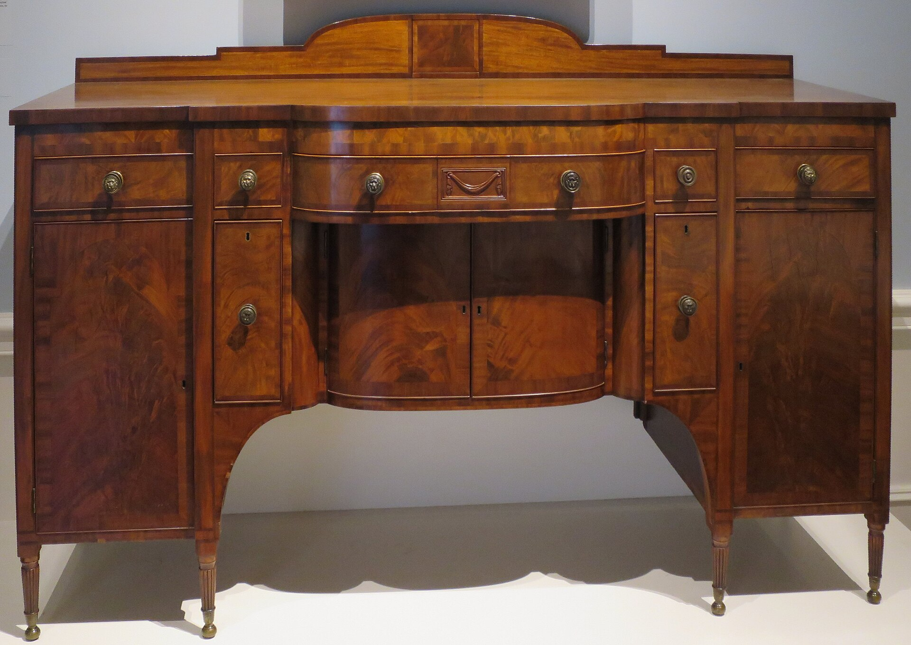

<figure>
  
  <figcaption>Regional American sideboards share a vocabulary—Boston, New York, Charleston—without pretending one shop made them all. Dayton Art Institute / <a href="https://creativecommons.org/publicdomain/zero/1.0/">CC0</a> (Wikimedia Commons).</figcaption>
</figure>

I am not going to give you a fake Charleston cabinetmaker with a good last name. I am going to give you three weathers.

New York, 1810 to 1820. The Met's cellaret is mahogany, white pine, tulip poplar. American shop guts under an English idea. The label says it stood in the sideboard's center opening and got wheeled to the table. That is a city with floors that could take a caster and dining rooms that wanted the dock-and-roll. New York is also Phyfe and Lannuier country — not because every cooler came from those benches, because those benches taught the city what a dining room was supposed to cost.

Boston, 1815 to 1825. The MFA cooler is rosewood veneer, brass stringing, lead lining, a lock with a GR stamp. Boston will show off. Rosewood is a show-off wood. Stringing is a show-off line. The job is the same as New York's. The jacket is louder. Sargent is painting in that city in those years. The object and the picture are neighbors.

Charleston and the rest of the coastal South. Heat. Humidity. A dining culture that took wine seriously and a climate that eats hide glue for breakfast. Veneer that was happy in London will sulk in August. I will not invent a shop. I will say the form is documented from New England down the coast, and the smart Southern work is the work that admitted the weather: solid where it needed to be solid, finishes that could take a wet summer, liners that could take melt. If you are buying a "Charleston cellarette" from a person who cannot tell you what the secondary wood is, you are buying a caption.

Regional character is a shop fact, not a flavor oil.

Secondary woods tell you where a piece was allowed to be cheap. White pine in Boston and New York is a New England and mid-Atlantic habit. Tulip poplar is a Mid-Atlantic and Southern workhorse. If I see a piece advertised as Charleston with clean white pine guts and a story, I get interested in the story's age.

Brass tells you about supply. A city with a foundry culture will cast rings and paw feet. A town without that culture will buy hardware from a catalog, then and now. Sheraton wanted cast rings. A rural shop wanted the rings to arrive on a boat.

Climate tells you about lids. A tight lid in a wet summer is a mold farm if anyone left water in the well. A lid with a little breath is a cooler that does not smell like a gym. I crack lids on wet boxes the way I crack lids on glue pots. The old houses knew. The old houses also had people whose job was to empty the well. You probably do not.

What I will not do is sell you a "New York" or a "Boston" as a finish color. Those words are cities. They had many shops. They had bad shops. They had imported English pieces that never saw a local bench. A regional attribution is a paper trail: wood, hardware, provenance, a construction habit. Without the paper, it is a feeling. Feelings are for choosing a stain, not a century.

Indiana is not in that coastal sentence. Ferdinand is a factory town with a German wood-working habit and a shop that opened in 1999. We are not a Federal workshop. We can still learn the regional lesson. Build for the weather the piece will live in, not the weather in the photograph. A cooler for a dry Colorado dining room is not a cooler for a Gulf house. The liner, the finish, the glue, the lid gap — those change. The silhouette can stay if you want the silhouette.

If you have a family piece, do not sand the secondary wood clean for Instagram. The guts are the passport. A restorer who loves you will leave the pine dirty enough to read.

Three cities. One job. Bottles upstairs, in the dining room, close to the table. The rest is accent. Next the stage those coolers docked in: the American sideboard, which learned to be a piece of architecture and never quite unlearned it.
