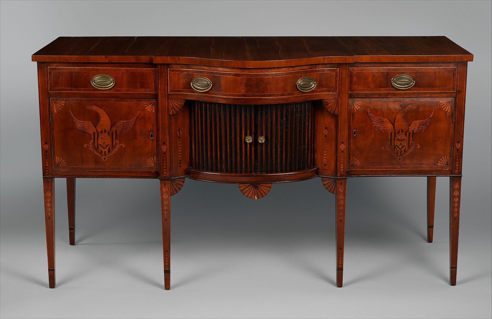

<figure>
  
  <figcaption>The sideboard is the dining room’s stage left—bottles, glass, and silver traffic through it. Metropolitan Museum of Art / <a href="https://creativecommons.org/publicdomain/zero/1.0/">CC0</a> (Wikimedia Commons).</figcaption>
</figure>

If the cellarette is the tool, the sideboard is the wall the tool hangs on.

I say wall on purpose. A good sideboard is not a table. It is a piece of vertical furniture that organizes the end of a dining room: silver up, linen in, bottles below or in the wings, a surface for the things you do not want on the table yet. Hepplewhite already wrote that a dining room was incomplete without one. Americans believed him and then made them heavier.

Duncan Phyfe's New York and the Empire shops that followed him turned the sideboard into a small building. Columns. Pedestal ends. Brass mounts. A long plinth. A center opening that is not a design accident — it is a slip for the cellarette. When the cooler rolls out, the sideboard still looks finished. When the cooler docks, the room looks like it planned the evening. That is a stage.

I have built servers and sideboards. I have also been sent photographs of "bars" that are trying to do the sideboard's job in a living room and the tavern's job at the same time. That is two plays. Pick a theater.

The American sideboard has a class performance I already named, and it has a shop performance I want to name now. It is long. Eight feet is not rare in the old ones. Long pieces rack. Long pieces hog a wall. Long pieces do not go up a tight stair. If you want the stage, measure the stair before you fall in love with the columns. I have refused lengths that would have made a beautiful dining room and a destroyed landing. The landing always wins, because the landing is where the piece gets stuck.

Pedestal ends are cabinets pretending to be architecture. One of them, historically, may still be a bottle store. If I build pedestal ends now, I decide which one is bottles and which one is linen, and I do not make both of them shallow jewelry drawers. A pedestal that cannot take a standing 750 is a costume.

The top is a serving surface. It will see a decanter, a plate, a wet glass, a plant someone swore they would not put there. Finish it like a serving surface, not like a jewelry box. We will get to films later. For now: the sideboard top is closer to a bar top than a bedroom dresser is. People forget because the piece is "dining." Dining is wet.

Knife boxes and urns on top are the old jewelry. They also steal landing. If you want to work on that top, keep the jewelry low or skip it. A forest of silver on a sideboard is a museum habit. A working house needs a pad of empty wood.

A liquor cabinet that stands in a dining room next to a sideboard is often a redundancy. I say that as a person who will still build it if the bottles do not fit the sideboard. Collectors outgrow Hepplewhite's nine. The sideboard keeps the performance. The cabinet keeps the overflow. Two objects. Two jobs. Do not make one object that is eight feet of sideboard and also a glass-door display case and also a fridge. That object is a kitchen.

In houses that killed the dining room, the sideboard sometimes moved to the hall and became a place for keys. The bottles moved with the performance to the living room. That is how you get a "bar cabinet" in a room that never heard of a crumb cloth. Fine. Just know you are using a dining-room invention in a sitting room. The height may be wrong. The depth may be wrong. The serving top may now be at cocktail height, which is a different elbow.

I like a sideboard that still knows it is a sideboard. Long. Closed. A good top. A place for a tray. Bottles where bottles fit. No television. No sink unless we have left dining and entered wet-bar country on purpose.

The stage does not need a spotlight. It needs a wall, a length, and a decision about what happens at the end of the meal.

Next the stage gets louder: Victorian carving, plate on parade, and the bottle that hid in the basement of the cliff.
