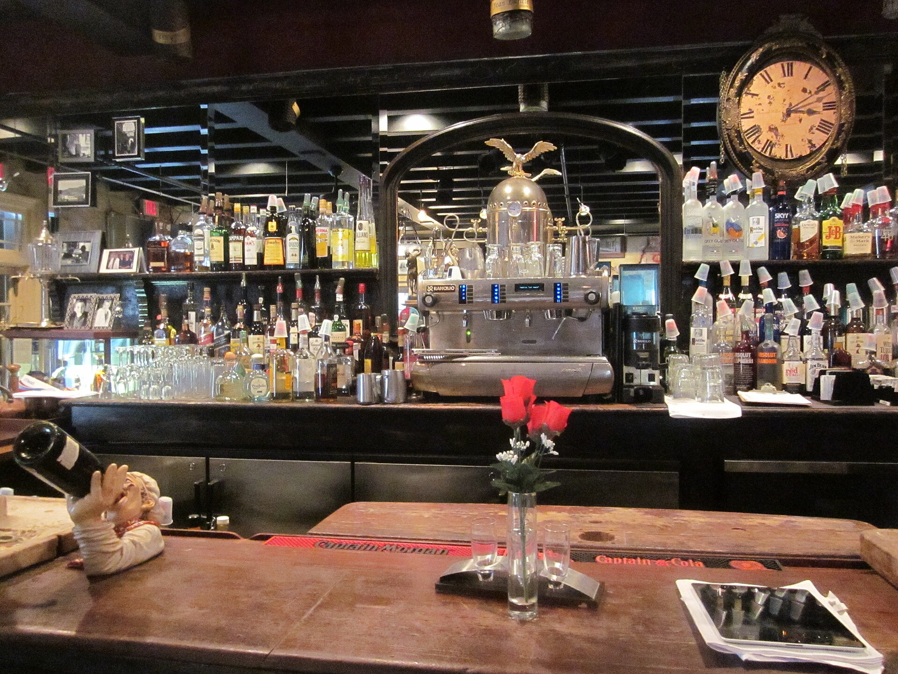

<figure>
  
  <figcaption>A fitted bar is a machine with a face—racks, mirrors, and landing zones in fixed order. Bmaurizi / <a href="https://commons.wikimedia.org/wiki/File:Absinthe_House_Back_Barroom_Espresso_Machine_Clock.JPG">CC BY-SA 3.0</a> (Wikimedia Commons).</figcaption>
</figure>

I want to stay inside the cabinet one more episode, because the 1930s are when the interior becomes the design.

A chest of drawers is a stack of boxes. A cocktail cabinet is a small room. The room has stations. Bottles here. Tools there. Glass overhead or in a door. A well for ice that is trying not to be a Hepplewhite lead drawer and not always succeeding. A leaf that is the counter. A light that is the window. If you sketch only the outside, you have sketched a wardrobe.

This is kitchen thinking applied to liquor. The fitted kitchen — I am not dating the entire kitchen revolution here — teaches a culture that interiors can be specialized. The bar cabinet is a tiny fitted kitchen that does not cook. Once you see it that way, the later wet bar is obvious. Someone will add a real sink. Someone will add a real fridge. The 1930s machine is the drawing before the plumber.

Shop discipline for a fitted interior.

Every part gets a dimension from an object, not from a feeling. Bitters bottles are short. Magnums are not. A shaker is wide. A jigger is a drawer-divider problem. If I guess, you will store the shaker on the leaf and the leaf will become a junk table.

Removable. The well comes out. The rack comes out if the glass changes. The mirror comes out if it breaks. Fitted is not the same as trapped. Period pieces are often trapped. We can do better without losing the romance.

Service access. If there is a light, there is a way to a junction that does not require destroying a veneer. If there is a lock, there is a way to a strike. A fitted cabinet that cannot be repaired is a museum object. Most of our objects have to live with a household.

The 1930s also like suites. The cabinet matches the radio, matches the table, matches a clock. That suite thinking is how a living room becomes a showroom. I am not against a match. I am against a match that forces a bad interior because the outside had to rhyme. If the suite wins, the bottles lose. Let the interior win.

Manufacturers will chrome anything. Chrome is honest about wipe-down and dishonest about fingerprints. If you want chrome racks, you want a person who will wipe them. If you do not have that person, you want wood racks and a towel.

I will build a 1930s-minded interior in a quiet case. That combination is how this shop actually thinks. Loud insides, manners outside. The Deco skyscraper exterior is optional. The stations are not.

When a younger maker asks me how to start a bar cabinet, I do not start with a door style. I start with a tray on a bench. I put the client's bottles on the tray. I put the glasses. I put the tools. I take a photograph. Then I draw the smallest room that will hold that tray and still close. That is the 1930s lesson without the chrome.

If the tray is two feet of chaos, the cabinet will be two feet of chaos. Edit the tray. Furniture cannot edit a collection. It can only house it.

The RadioBar gathered sound into this room. Later the television will stand over it. Later the speakers will hide in it. I would rather the cabinet stay a cabinet. Sound has its own boxes. When we mix them, we mix heat and service holes and a repair that is two trades. The 1930s can be forgiven for being excited. We have less excuse.

Next the piece that refuses to be a room: the cart. Wheels. A tray. Hospitality that comes to you, which is the cellarette's old trick in a chrome century.
