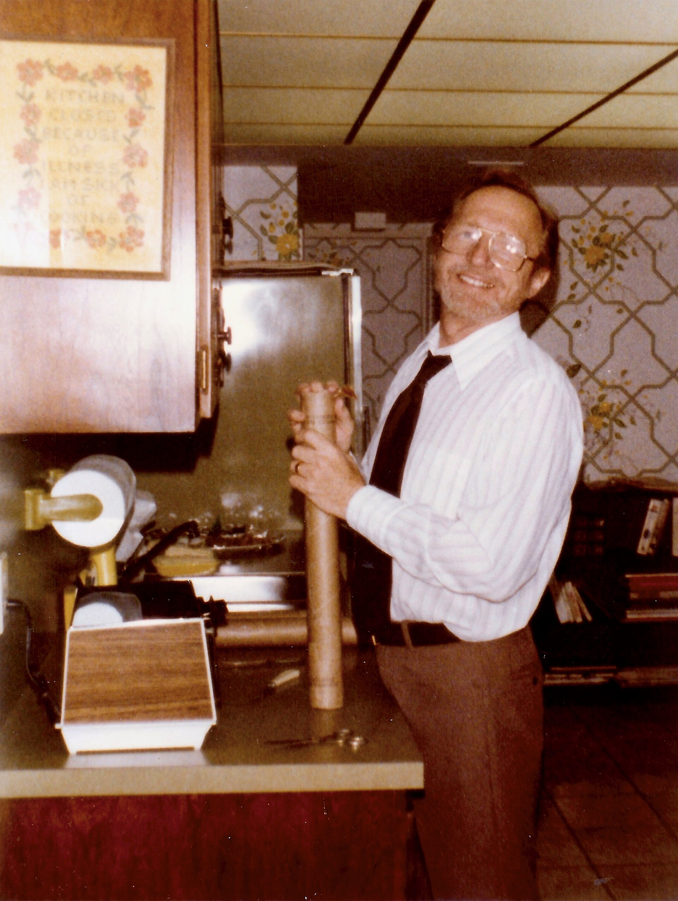

<figure>
  
  <figcaption>Suburban wet bars often lived next to rec rooms—plumbing, paneling, and a counter, not only a cabinet. Infrogmation family photos / <a href="https://commons.wikimedia.org/wiki/File:Standing_in_the_Kitchen,_1973.jpg">CC BY-SA 4.0</a> (Wikimedia Commons).</figcaption>
</figure>

After the war, a lot of American houses grow a room that is not trying to be a dining room. Rec room. Rumpus room. Basement that got a ceiling. The furniture of that room is allowed to be informal. The bar that grows there is allowed to have a sink.

That sink is the news. Not the paneling. Not the stools. The sink means the house committed water to hospitality downstairs, away from the kitchen. That is a built-in decision. Supply. Waste. A vent if the plumber is honest. A GFCI conversation if the electrician is honest. Wood around all of that if a cabinetmaker got invited.

I did not open until 1999. I did not build these rooms in 1962. I have been asked to replace the wood in them. The wood is usually the easy part. The mystery trap, the out-of-level floor, the fridge that was a dorm fridge in a cupboard — those are the history.

Why the suburbs wanted it.

The dining-room performance was upstairs and tired. Company still came. Teenagers still needed a place that was not the good sofa. A basement bar is a second hospitality that does not risk the carpet Sargent cared about. It is also a status object. We have a bar. The sentence worked at an office on Monday.

Tiki, knotty pine, a wagon-wheel light — those are flavors. They are not required. A wet bar can be a simple counter, a basin, a closed case for bottles, a fridge that vents. The flavors date. The plumbing dates slower.

Stools are a tell. Once you add stools, you have asked the piece to be a tavern. A tavern has a kneeler, a rail maybe, a height that is bar height, not counter height, not table height. Those heights are not interchangeable. A cabinetmaker who copies a kitchen counter and then puts stools under it will make a row of people who look like they are waiting for a child's snack. Measure the stool. Measure the thigh. I am not being cute. I am being the person who gets the complaint.

The rec-room bar is also where hotel parts start to leak. A brass rail. A mirrored back. A speed rail. We will give those their own episode. For now: if you import a restaurant part into a basement, you import a restaurant clean. Sticky rails. Cloudy mirrors. A speed rail that collects pennies and orange pulp. Be ready to wipe or do not buy the part.

Shop stance.

This shop's public life is furniture on trucks. A rec-room wet bar is a construction sequence. We can make the cases. We can make a better door than the knotty-pine original. We do not pretend we are the plumber. If you want us in that room, the plumber and the electrician go first, or we go first with a drawing that leaves them holes that are real.

A lot of these bars were built by a handy owner. I respect handy. I also open those carcases and find particle board, a dryer vent used as a duct, and a stain that was never a system. Replacement is not snobbery. It is moisture.

If you are keeping a mid-century rec-room bar because it is the family room's memory, keep the memory on purpose. Save a door. Save the rail. Put a new carcase under it that can take a leak. Nostalgia that cannot take a leak is how a basement smells.

The rec room taught America that a bar could be a place you stand, not a box you open. That lesson walks upstairs later and tries to live in the living room. Sometimes it fits. Sometimes the living room wanted a credenza.

Next the louder cousins: paneled dens, sunken floors, the 1970s bar that wanted to be a nightclub in a house.
