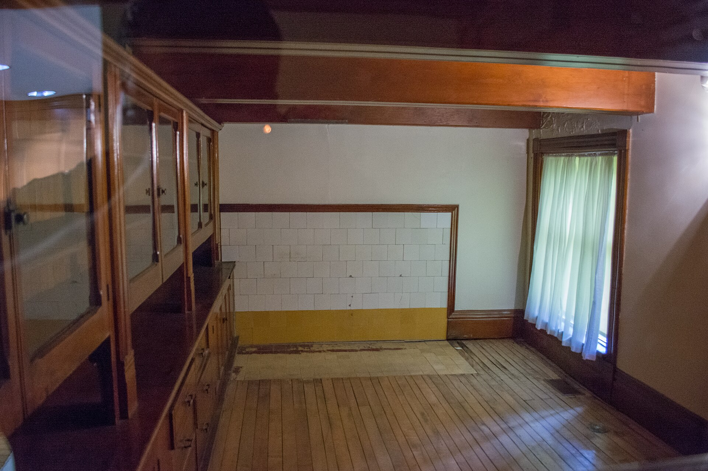

<figure>
  
  <figcaption>Today’s pantry revival often wants display; the historic pantry wanted throughput. BC in Arizona / <a href="https://commons.wikimedia.org/wiki/File:Butler_pantry_-_Lawnfield_-_Garfield_House_Historic_Site_(30687623511).jpg">CC BY-SA 2.0</a> (Wikimedia Commons).</figcaption>
</figure>

I already took the butler's name back once. I need to do it again, because the revival is a floor plan, not a caption.

New houses and remodeled houses love a room between the kitchen and the dining room that they call a butler's pantry. Glass doors. Quartz. A second dishwasher. A wine fridge. A coffee machine that has its own plumbing. That room is a second kitchen, or it is a display corridor, or it is both. It can be a good room. It is a terrible living-room bar.

Why.

Because the work of that room is service and overflow. The work of a living-room bar is staying with the guests. If you put the bottles in the pantry, you leave the guests. If you put the guests in the pantry, you have seated people in a workroom. If you duplicate the bottles — pantry and living room — you have two collections and a lie in each.

I want the program said in verbs.

Where do you stand when you pour for company.
Where do you rinse.
Where do you hide the blender.
Where does the extra wine live that nobody needs to see.

If pour-for-company is the living room, the living room gets the honest dry cabinet, or a wet bar if you committed water there. The pantry gets overflow, glass storage, the second dishwasher, the ugly appliances. If pour-for-company is the pantry, you have decided the dining room is the stage and the pantry is the backstage with a basin. Then you do not also need a tavern in the den, unless you are a household that hosts two kinds of nights. Some are. Say so.

The revival pantry often wants glass doors because the designer wants the glow. Glow is the opposite of service. Service wants to hide a mess. If the pantry is a second kitchen, give it closed doors where the mess is, and glass where the china is if you must. A wall of glass on small appliances is a store.

Wine fridge in the pantry: often right. Wine fridge in the living room: a furniture problem we will do in the cold-machine episode. Two wine fridges: a collection. One wine fridge and a lie about the other room: a waste.

I build furniture. I get asked to "do the pantry" as if it were a credenza. It is not. It is millwork, usually, and appliances, and a floor that is already a kitchen floor. We can make doors that match a dining room piece. Matching is a finish conversation. It is not a reason to put bar stools in a pantry.

The living-room bar should not try to be a pantry. It should not store the turkey platter. It should not hide the toaster. Those objects will win. They always win. Then the bottles stand on the top and we are back to a kitchen counter.

Two rooms. Two jobs. The old house knew. The kitchen cooked. The pantry served. The dining room performed. The living room sat. We collapsed those rooms and then we tried to buy them back with one word. Butler. The word cannot do it.

If you only have one extra wall, pick the job that matches the evening you actually have. A weekly living-room pour: dry cabinet in the living room. A weekly dinner: pantry that works, dining room that is a dining room. A yearly party: do not build a room for a party hat.

Next the kitchen itself eating the dining room and keeping the bottles on an island, which is a different collapse.
