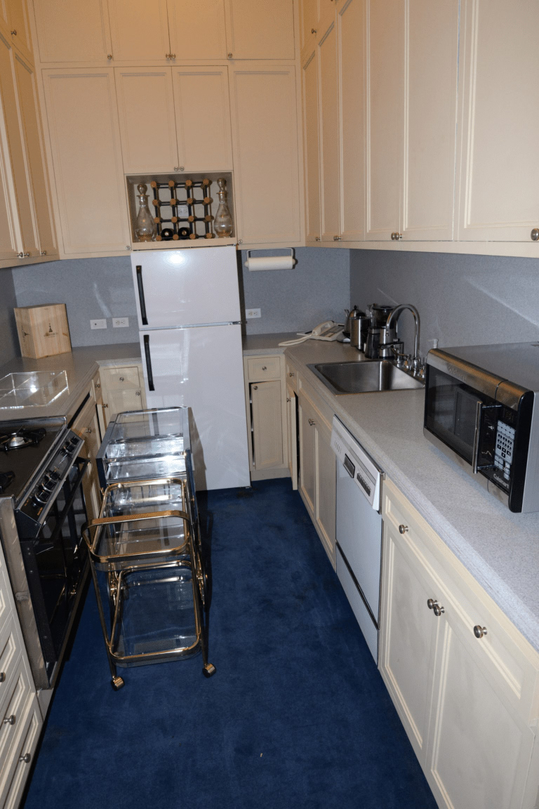

<figure>
  
  <figcaption>Kitchen-adjacent bars share traffic with cooking—storage height and landing space matter. U.S. federal exhibit photo / <a href="https://commons.wikimedia.org/wiki/File:EFTA00001443_-_Kitchen_with_cream_cabinets_a_white_refrigerator_a_blue_carpet_and_stainless_steel_appliances_featuring_a_glass_cart_and_a_wine_rack_on_the_wall.jpg">public domain</a> (Wikimedia Commons).</figcaption>
</figure>

The dining room lost a lot of arguments. The kitchen was one of them.

Open plan. Island. Stools. The sideboard's job — serving, parking, showing — moved onto a piece of kitchen. The cellarette's job — bottles close to the conversation — moved into a cubby next to the glasses, or onto the island next to the knives. Convenience won. Furniture lost a room.

I am not here to restore 1821. I like a house that cooks in the same air it talks in, if the household is that household. I am here to say what the kitchen does to bottles.

Heat. Ovens. Dishwashers. Sun from the slider that the realtor loved. Wine cares. Some spirits care less and still care. A glass-door cabinet over an oven is a display of cooked labels.

Grease. A kitchen is a grease climate. Open shelves of glass in the line of a range are a cleaning hobby. Closed doors help. They do not make the kitchen a library.

Kids. Guests. A knife block. The island is a traffic circle. A bottle on an island is a spill in a traffic circle. A locked cabinet in a kitchen is possible and looks like you do not trust the room, because you do not, because the room is a workshop.

Appliance garages. I have a little respect. A door that goes down on a blender is the 1930s fitted lesson. If the garage also holds bottles, measure the heat from the coffee machine. If the garage is the only bar, you have put hospitality in a cubby. Cubby hospitality feels like cubby hospitality.

What I will build near a kitchen.

A case that is furniture, not a box the cabinet company leftovered, if the client wants the bottles to look like they belong to a dining tradition and not to a small appliance. That case may still be a built-in if it dies into the kitchen run. Then it should take the kitchen's abuse: a film, a stone top if it is a landing, no delicate inlay on the corner a hip will hit.

A tall closed pantry end that is bottles, not cereal, with a landing that is not the island. Two landings again. Prep and pour. If they share, the pour loses at five o'clock when someone is cutting onions.

What I will not do is pretend an island overhang is a bar because stools fit. That is a breakfast counter. It can host a drink. It is not a liquor cabinet. The cabinet is the storage and the order. The overhang is seating. Seating does not organize a collection.

If the dining table still exists in the open room, a sideboard still has a job. I will fight for a piece of wall for it. The island cannot hold linen and plates and a turkey and also be the cellarette. The island is already employed.

Kitchen companies will sell a "bar alcove" as a SKU. Sometimes it is good. Sometimes it is a 24-inch fridge and a cubby. Read the vent. Read the bottle height. Read whether the alcove is in the grease line. A SKU is not a sin. An unread SKU is.

This shop is not a kitchen company. We have made casegoods that live in dining rooms that happen to be open to kitchens. The piece still has to be a piece: finished, movable if we said furniture, scribed if we said built-in. The open plan does not change the three questions. It just puts them in a louder room.

Next the contemporary millwork bar: glass, stone, LED, the whole glow, and how to keep it from being a nightclub that cannot take a wet glass.
