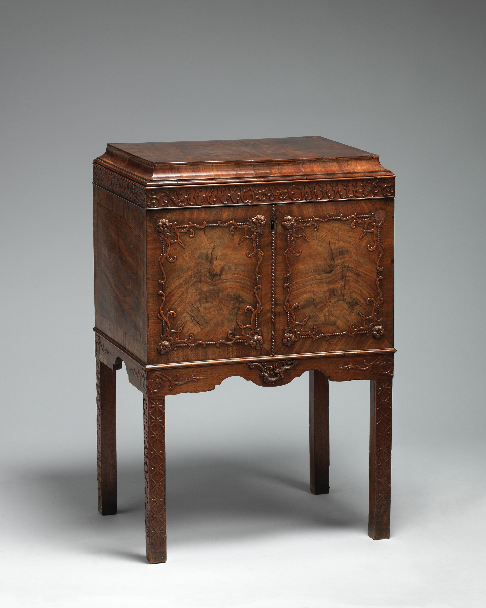

<figure>
  
  <figcaption>Interior lights heat a void—LED is habit; halogen is how you cook a label. Metropolitan Museum of Art / <a href="https://creativecommons.org/publicdomain/zero/1.0/">CC0</a> (Wikimedia Commons).</figcaption>
</figure>

The Deco cabinet wanted a light when the door opened. The contemporary millwork bar wants a light that never shuts up. Both are asking the same physics.

Light is heat. Light is a spectrum. Wine is a snob about both. Spirits are less of a snob and still do not want to live in a tanning bed. Labels fade. Closures warm. A sealed cabinet with a hot lamp is an oven with glass.

Old puck lights — halogen, the little stars of the 1990s and 2000s — will cook. I have felt the top of a cabinet after a party. You could rest a cup. That is a failure that photographed well.

LED is the current habit because it is cooler and small. Cooler is not cold. A tape stuck to the underside of a thin shelf will still make a heat line and an adhesive line. Mount it in a channel. Give it air. Give it a driver you can reach without destroying a veneer. The driver is a little brick that fails. If I bury the brick, I have built a disposable interior.

Door switches are charming and they fail. A switch in a hinge is a hinge that has a second job. I like a dimmer the household can find, and a switch that is not inside a wet well. If the light only works when the door is open, the contemporary glow people will be sad. If the light always works, the wine people will be sad. A timer or a dimmer is the compromise. I am not wiring a smart home unless the house already has one and a person who owns it.

Spectrum. Warm light makes whiskey look like a movie. Cool light makes a label readable. I would rather read a label. You can warm the room with a lamp that is not inside the case.

Ultraviolet. Glass doors plus sun plus interior light is a pile-on. If the piece faces a slider, I want a way to kill the interior light in the day, or a door that is not a window, or a film that the glass person will warranty. I do not sell miracle glass. I sell a location conversation.

Mirrors multiply light and also multiply lamps. Two tapes and a mirror is a lot of sparkle and a lot of reflection of the ugly outlet. Aim the light at the bottles, not at the room, if you can. If you cannot, you wanted a lantern.

Heat also comes from the fridge. Do not put a lamp against a compressor housing. Do not put a lamp in a box that already cannot breathe. The climate episode is coming. Lights and compressors are roommates who should not share a pillow.

This shop still likes a piece that looks good with the doors closed and the lights off. That is a furniture test. If the piece is nothing without the glow, the piece is a display. Displays are for fairs. Houses have Tuesdays.

Glass shelves with a tape under them look like a jewelry store and then the shelf becomes a light fixture that also holds bottles. I would rather put the light in a header and leave the shelf as a shelf. If the header is a dark wood, the light still works. If the header is a mirror, we are back to doubling the outlet.

A battery puck from a hardware aisle is how a good piece gets a cheap forehead. The puck dies, the adhesive stays, the circle of finish is a different color. If the household insists on a puck, we still give it a screw and a cup, not a sticker.

If we skip lights, we are allowed. A lamp in the room and a cabinet that opens is 1821 and it worked. Lights are a convenience. They are not a virtue. I would rather a dark excellent interior than a bright cooked one.

When a designer sends a night rendering, I ask for the Tuesday rendering: doors closed, sun in the room, nobody performing. If the piece disappears, we have a problem with the wood, not with the lack of a tape. If the piece holds, we can add a light as a courtesy.

Next hardware: locks we already understood, slides that have to hold a pour, and the ghost of a 1925 latch that should stay a ghost.
