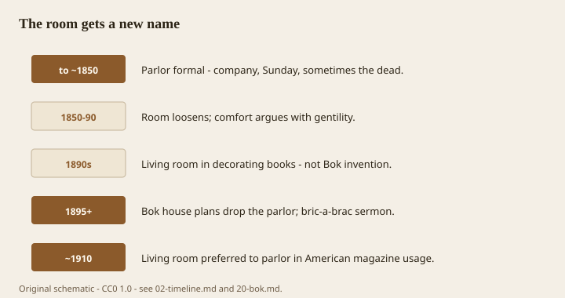

---
title: The room is younger than the box
slug: 05-the-room-is-younger
series: living-room-chests-storage-history
status: draft
voice_check: edited
dek: "<figure class='lrch-figure'>"
meta_description: "<figure class='lrch-figure'>"

figure_id: room-name-spine
image_rights: documented
image_pass: 2026-09-14
---# The room is younger than the box

<!-- lrch-figure:v1 -->
<figure class="lrch-figure">
  
  <figcaption><strong>Fig. 1.</strong> The living room is an American winning name for a front room you use on a weekday — younger than the chest it inherits. <em>Rights:</em> CC0 1.0 (original schematic); Keith BBF / COSMOS content pack; <a href="../content/living-room-chests-storage-history/RIGHTS.md">source</a>. Parlor-to-living-room name spine — not a floor plan.</figcaption>
</figure>

The living room is a late argument that won. The chest is not an argument. It is a box with a lid, and it was already old when the people who named parlors were learning to speak French in English houses.

That gap is the whole trouble with “living room storage furniture.” The category talks as if a room invented a need. The need is older than the room, older than the house plan, older than the idea that a family should have a decorated front space in which nobody lives. What changed is not the existence of extra blankets. What changed is which room was allowed to show that it had them.

A parlor, if you had one, was for talking and for being seen to talk. *Parler.* It was also, in a lot of American houses, for the Sundays and the funerals. You did not keep the scarred everyday box there if you could help it. You kept a whatnot, a pier table, a set of chairs that remembered their manners. Storage happened in chambers, in halls, in kitchens, in the attic, in the chest at the foot of the bed. The chest did not need the parlor. The parlor needed to look as if nobody stored anything.

By the 1890s some decorators were already writing “living room” when they meant a room that showed a person instead of a convention. Edward Bok, at the *Ladies’ Home Journal*, did not coin the words. He did something more useful and more bossy: he published house plans that left the parlor off the drawing, and he told women that bric-a-brac was making them nervous. He wanted the front room used on a Tuesday. Once you use a room on a Tuesday, you need a place to put Tuesday. The chest comes back through the door it was never supposed to use.

By about 1910 the American magazine house prefers “living room” to “parlor.” That is a dating from people who count magazines. Real streets are slower. You can still find a parlor in a mouth that never read Bok. You can also find, in a 1924 bungalow, a cedar chest under the front window because the room is finally allowed to hold a life.

So a history of living-room chests is not a history of a type. It is a history of a relocation. The objects — six-board, cassone, mule, commode, tansu, Lane, Eames unit, storage ottoman — were built for chambers, processions, shops, ships, trousseaus, and factories. The living room inherited them the way a new country inherits a language: badly, with an accent, and with a retail department that will sell you the accent in walnut veneer.

If you want a test: look at the piece in the room you actually sit in. Does it open from the top, like a medieval habit? From the front, like a seventeenth-century convenience? From a drop panel, like a bandaji? Is it a machine wearing a cabinet? Is it a padded lid you sit on because the chest was ashamed to look like a chest?

The room is about a hundred and thirty years old in the name that stuck. The box does not care.
