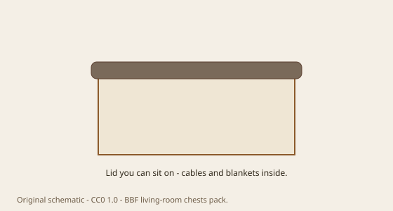

---
title: The soft chest
slug: 23-ottoman
series: living-room-chests-storage-history
status: draft
voice_check: edited
dek: "<figure class='lrch-figure'>"
meta_description: "<figure class='lrch-figure'>"

figure_id: storage-ottoman
image_rights: documented
image_pass: 2026-09-14
---# The soft chest

<!-- lrch-figure:v1 -->
<figure class="lrch-figure">
  
  <figcaption><strong>Fig. 1.</strong> A six-board in softer clothes — ask whether the lid stays up. <em>Rights:</em> CC0 1.0 (original schematic); Keith BBF / COSMOS content pack; <a href="../content/living-room-chests-storage-history/RIGHTS.md">source</a>. Storage ottoman as upholstered lidded box.</figcaption>
</figure>

An ottoman, in the English and American house, is a padded stool or a low upholstered seat. The name traveled from Turkish seating in the eighteenth and nineteenth centuries and then forgot the trip. For a long time it did not store anything. It was a place for a foot or a second body.

The storage ottoman is a chest that is ashamed of wood. Lift the lid — now upholstered — and the blankets are there, or the toys, or the extra pillows that the sofa throw is lying about. It is a six-board chest in a suit. It returns the medieval right to sit on your storage, which the chest of drawers had cancelled.

Living rooms love it because it does not look like work. A cedar chest still says “linen” and “someone’s mother.” An ottoman says “we planned the seating.” The contents are the same. The lie is softer.

I am not against the lie. A room full of hard lids is a warehouse. A room full of only soft lids is a nursery. One soft chest in a circle of chairs is a decent compromise, which is all a living room is.

The hardware, if you can call it that, is a hinge that will take a child’s finger off if it is cheap, and a lid stay if someone thought for ten minutes. That is the whole quality scale. Forget wood species. Ask whether the lid will stay up while you find the extra sheet with one hand.
