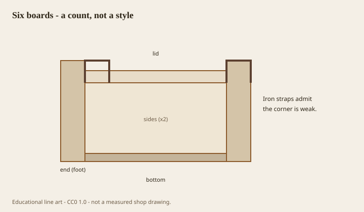

---
title: Staging a chest in a room (the other “staged”)
slug: 28-staging
series: living-room-chests-storage-history
status: draft
voice_check: edited
dek: "<figure class='lrch-figure'>"
meta_description: "<figure class='lrch-figure'>"

figure_id: six-board
image_rights: documented
image_pass: 2026-09-14
---# Staging a chest in a room (the other “staged”)

<!-- lrch-figure:v1 -->
<figure class="lrch-figure">
  
  <figcaption><strong>Fig. 1.</strong> Staging is not the subject — but a cassone-length box in a small room is a dock. <em>Rights:</em> CC0 1.0 (original schematic); Keith BBF / COSMOS content pack; <a href="../content/living-room-chests-storage-history/RIGHTS.md">source</a>. Six-board chest construction schematic.</figcaption>
</figure>

Furniture staging, the real-estate kind, loves a chest. It is low, it takes a lamp, it takes a bowl, it takes a stack of books that have never been opened in that county. The photograph says “storage” without showing a sock.

If you are actually living:

**Height.** Under a window is the old good place. The lid or the top should clear the sill or sit in a deliberate overlap, not a half-blocked sash. Beside the sofa, not behind it, unless the chest is a sofa table in disguise and you like walking into brass.

**Top.** One lamp, or none. A tray if the lid is a table. Nothing that has to be moved with two hands every time you want a blanket. If you cannot open the piece without a project, it is a pedestal.

**Wall.** A chest of drawers wants to be a face. Give it a wall. A six-board can live in the room like a boat. A tansu with carry handles should not be jammed so the handles bruise the plaster.

**Scale.** A cassone-length box in a small room is a dock. A tiny “accent chest” under a huge painting is a footstool with aspirations. The highboy we already warned you about.

**The runner.** A textile on a Lane lid protects the finish and hides the factory. Decide which you want. I would rather see the lid. The lid is the point.

**Opening.** Sit on the floor and open it the way a guest will not. If the drawer hits the sofa, the sofa wins and the drawer becomes dead architecture. Dead architecture is a parlor object.

Staging for a sale and staging for a Tuesday are different morals. This set is for Tuesday.
