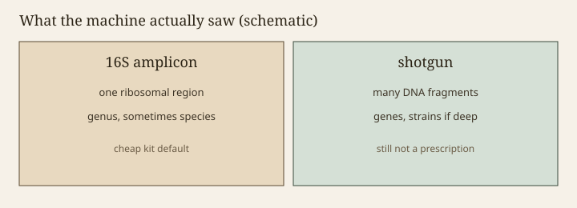

**Disclaimer.** Educational only. Not medical advice. Dietary supplements are not intended to diagnose, treat, cure, or prevent any disease (DSHEA; 21 U.S.C. § 321(ff); 21 CFR 101.93). A sequencing report is not a diagnosis and not a recommendation to start, stop, or switch a live-microbe product.

A consumer stool kit is usually a 16S rRNA amplicon assay wearing a wellness dashboard. The laboratory amplifies one (sometimes two) variable regions of a ribosomal gene, sequences the fragments, and assigns them to taxa against a database that has a date. That method built much of the Human Microbiome Project's first maps. It is a good tool for asking "which groups are present at what relative abundance in this stool, under this pipeline." It is a poor tool for answering "which capsule should I swallow."

> **Photo:** Two-panel schematic: one gene region versus many fragments.
> **Caption:** What the machine saw, not a ranking of products.
> **License note:** Original, `assets/sixteen-s-vs-shotgun/amplicon-vs-shotgun.svg`.

<figure class="blog-figure">
  
  <figcaption><strong>Figure.</strong> What the sequencing machine saw in each method — not a ranking of products or a prescription. <em>Original schematic; not clinical data or a product claim.</em></figcaption>
</figure>

## What 16S can say

It can say that, in this sample, processed this way, reads assigned to *Bacteroides* outnumber reads assigned to *Prevotella*, or that a genus you have been told to fear is sitting at 0.4 percent. Relative abundance is not cell count. A 40 percent slice of a low-biomass sample is not the same object as a 40 percent slice of a dense one. Kits that skip a biomass conversation are already selling a picture.

It can sometimes reach species. Often it stops at genus. The V4 region that many studies use is famous for being cheap and for collapsing species that matter to a label. *Escherichia* and *Shigella* do not always part ways. *Bifidobacterium longum* and its cousins can blur. A strain designation — the only unit Hill 2014 treats as default — almost never falls out of a short amplicon. If a dashboard prints *Lacticaseibacillus rhamnosus* GG because you bought a GG capsule, that is a story about marketing, not about read length.

It cannot tell live from dead. DNA persists. A cooked yogurt and a live yogurt can both light up. A person who took an antibiotic last month and a person who did not are not separated by a pretty bar chart alone.

## What shotgun can say

Shotgun metagenomics breaks all the DNA it can get and tries to assemble or map genes and genomes. Done well, with enough depth, it can reach strains, resistome genes, and functional pathways. MetaHIT's gene catalogue (Qin 2010) is a shotgun object. It costs more. It still depends on databases, dehosting, and a bioinformatician's choices. Two labs can disagree on the same FASTQ.

Shotgun still does not prove the organism is metabolically active in that person today. It does not prove a capsule of a related isolate will engraft. It does not give a reference range with clinical decision limits. It can support a research paper. It cannot ethically auto-dispense a SKU.

Metatranscriptomics, metabolomics, and culture sit further up the cost curve. They answer different questions (RNA, small molecules, a living isolate). A brand that sells 16S and talks as if it sold the rest is inflating the method.

## Pipeline is a silent author

Primers, region, quality filters, OTU versus ASV (DADA2 and friends), the SILVA / Greengenes / GTDB vintage, rarefaction depth — each choice moves the chart. A 2013 Greengenes assignment and a 2020 GTDB assignment will rename your life. After Zheng 2020, even the *Lactobacillus* bar is a historical object. Draft 08.

If a company compares your 2026 V4 run to an HMP table built on a different region and an older database, the red/green "low diversity" badge is a methods mismatch wearing a mood. Ask for the pipeline version on the PDF. If they will not print it, the PDF is a brochure.

## Relative in, decisions out

Most kits report composition, not dose. They then attach food lists, supplement lists, and sometimes a house-brand blend. That last step is the intended-use risk. A lab-developed test plus a cart is how a sequencing hobby becomes a drug claim or a deceptive ad, depending on the nouns. FTC 2022 cares about the claim as a reasonable person reads it. "Your *Akkermansia* is low; buy our *Akkermansia*" is a reasonable person reading a prescription. Draft 21, draft 31.

Even the food lists overreach. "Eat more artichokes because your bifidobacteria are low" may be harmless dietary chatter. It is still a causal story the amplicon did not earn. Diet does move communities (David et al., 2014; draft 30). Your particular bar chart did not prove artichokes are the lever.

## What to do with a report you already bought

Read it as a snapshot of DNA in one stool, one day, one pipeline. Look for methods. Ignore the cart. If a clinician ordered a test in a workup, that is their file, not this essay. If a founder wants to sell a kit beside a live-microbe SKU, the clean design is: the kit does not pick the SKU. The SKU, if it exists, has its own strain, CFU-through-shelf, and human endpoint — or it does not get the word probiotic.

The short version you can keep in a pocket: 16S is a census of one gene region. Shotgun is a messier, richer census of DNA. Neither census is a pharmacy.

<!-- expand -->
## Depth, biomass, and the empty well

A low-biomass sample sequenced hard will still produce a chart. Skin and some vaginal swabs are famous for this; stool is usually easier, and still not a cell count. Kits that skip a biomass or spike-in conversation are selling composition as if it were dose. Relative abundance can rise because everything else died. That is a different story than "this taxon bloomed."

Contamination in reagents is a known 16S hobby, especially at low biomass. A careful lab runs blanks. Ask whether they did. A wellness PDF that never mentions a negative control is a brochure.

## Databases have birthdays

Greengenes, SILVA, RDP, GTDB — pick a year. *Lactobacillus* bars jump in 2020 (draft 08). Species that were lumped get split. A longitudinal subscription that changes databases mid-stream will "improve" or "worsen" a customer without the colon voting. Print the database vintage on the PDF or admit the PDF is decorative.

Closed-reference OTU picking versus ASV methods is another silent author. Two honest 2016 and 2024 papers on "the same" question may not be about the same features. Meta-analyses that ignore that are weather (draft 12).

## What to ask a vendor who wants to sit next to a SKU

Which region. Which primers. Which pipeline version. Whether they report live/dead (they do not, if they only have DNA). Whether the report names a product (it must not). Whether a clinician ordered it (if not, it is not a clinical test). Draft 31 is the cart version of this list. Draft 32 is what happens when billing and beauty outrun the list.

If you already paid for a report, keep the FASTQ if they will give it to you. The PDF is an interpretation. Interpretations age faster than reads. A later editor who wants to "personalize" a live SKU from those reads should read draft 21's *Akkermansia* bar first, then stop.
