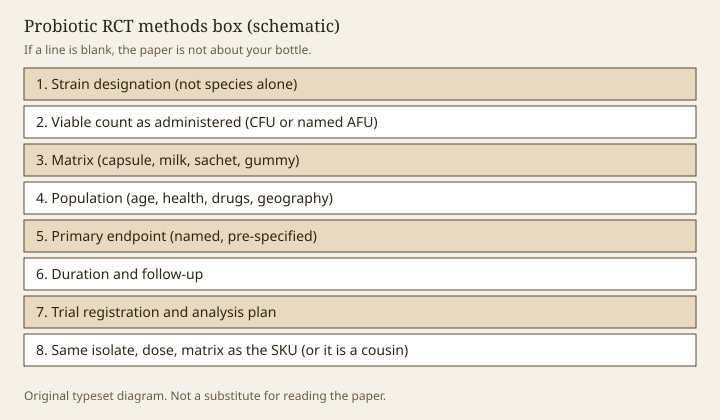

**Disclaimer.** Educational only. Not medical advice. Dietary supplements are not intended to diagnose, treat, cure, or prevent any disease (DSHEA; 21 U.S.C. § 321(ff); 21 CFR 101.93). This essay is a reading habit for papers. It is not a protocol and not a way to self-assign a product.

A randomized trial of a live microbe is easy to over-read. The abstract says "probiotic." The aisle says "probiotic." The objects are usually different. Hill 2014 and Binda 2020 tell you what the scientific object is. FTC's December 2022 *Health Products Compliance Guidance* tells you what advertising may claim. Neither document cares that the PDF was pretty.

> **Photo:** A marked-up methods box: strain, CFU, matrix, weeks, endpoint, n.
> **Caption:** If a line is blank, the paper is about something else than your bottle.
> **License note:** Original typeset. No fake data.

<figure class="blog-figure">
  
  <figcaption><strong>Figure.</strong> If a line is blank in the paper, the trial is not about the bottle on the shelf. <em>Original schematic; not clinical data or a product claim.</em></figcaption>
</figure>

## Eight lines that have to exist

**1. Strain, not species.** Genus + species + designation +, ideally, a deposit. "L. acidophilus" is not a strain. After Zheng 2020, it is not even a stable address without the rest (draft 08).

**2. Viable count as administered.** CFU or a named alternative (AFU; draft 13), at the dose the person took, not at hopper fill. If the paper only reports manufacture counts, the intervention is under-described.

**3. Matrix.** Capsule, fermented milk, sachet, gummy. Acid, water activity, and companion ingredients change survival. A trial in yogurt is not a trial in a gummy.

**4. Population.** Age, health status, concomitant drugs, geography. A NICU row is not an adult Amazon row (draft 36). Unprepared travelers are not people with a chronic clinic diagnosis.

**5. Endpoint, locked.** Primary versus secondary. Symptom score, a biomarker, a time-to-event. "Gut health improved" is not an endpoint. A 16S shift is an ecological readout unless you pre-specified why it matters (drafts 04 and 07).

**6. Duration and follow-up.** Four weeks is not twelve. Effects that vanish when the capsule stops may still be real; they are not "repopulation."

**7. Registration and analysis.** A ClinicalTrials.gov or equivalent ID, a protocol, and a statistical plan that was not invented after the p-values arrived. Small n with many scores is a garden.

**8. Identity with the SKU.** Same isolate, same dose through shelf, same matrix, or you are reading a paper about a cousin. "Clinically studied blend" usually fails here (draft 15).

## Blinding and the smell of yogurt

Live-microbe trials are hard to blind when the vehicle is a food. Capsules are easier. Ask. Placebo that is the same matrix without the isolate is the minimum. If the control is "nothing," you have a different study.

Rescue medication, antibiotic indication, and diet advice in the protocol are silent authors. A trial that tells both arms to eat more fiber is partly a fiber trial (draft 30).

## Industry, ghosting, and the missing negative

Sponsorship is not an automatic fail. Non-disclosure of strain identity in a sponsored trial is. Outcomes that exist only in an abstract, or only in a house white paper, are not a file. Publication bias in this category is a known weather pattern (draft 12). GRADE tables, as in AGA 2020, spend a lot of ink on certainty. That ink is the opposite of a press release (draft 10).

## Animal and in-vitro pages wearing RCT clothing

Caco-2 assays, acid-bath graphs, and mouse stool transfers are not human RCTs (drafts 11 and 42). They can justify *doing* a human trial. They cannot finish a 101.93 substantiation file for a consumer claim. If the PDF's only humans are the authors, you do not have a host benefit in Hill's sense.

## Disease endpoints and the wrong room

If the primary endpoint is prevention or treatment of a disease, you are reading a drug-shaped question. In the United States that question lives with IND/LBP rules when the intervention is a live biotherapeutic aimed at disease (drafts 37–38). You may *describe* such a trial in an educational essay. You may not park its sentence on a supplement PDP. AGA's *C. difficile* and NEC rows are the teaching examples of that wall.

## A short reading order

Title, then methods, then tables, then abstract. If methods will not give you strain and dose, stop. If the table's significant line is a secondary score among twelve, write that down before the headline enters your brain. If the SKU on the shelf cannot show it is the intervention, the paper is a neighbor. Neighbors do not go on labels.

This habit is the whole pack in miniature. The rest of the essays apply it to particular organisms, foods, tests, and statutes. The RCT is where a "benefit" either appears or does not. Everything else is atmosphere.

<!-- expand -->
## Registration as a document, not a halo

An NCT number is a promise that a protocol existed. It is not a promise that the paper matches the protocol. Read the primary outcome on the registry, then the paper. If they disagree, write that down before the abstract enters your bloodstream. Secondary scores that appear only in the paper are the garden (draft 12).

Preprints and "data on file" are not automatically lies. They are not automatically evidence for a 101.93 sentence either. FTC 2022 does not grade on a curve because the PDF was hosted on a house domain.

## Populations that silently change the object

Healthy students, unprepared travelers, people already on antibiotics, people with a clinic diagnosis, preterm infants — these are different interventions even if the isolate matches. AGA 2020's rows are population-shaped (draft 10). A trial in one population does not move to another because the Latin matches. Draft 36 is the expensive version of that sentence.

Dropout, rescue medication, and diet advice belong in the results the way CFU belongs in the methods. If they are missing, the intervention is under-described.

## A one-page worksheet

Print the eight lines from the top of this essay on a sheet. Fill them from the PDF. If three lines are blank, you do not have a file for a SKU. You have a paper about a cousin or a hope. Draft 15 is what the aisle says instead of filling the sheet. Draft 44 is the same sheet for a buyer who never wanted to become a trialist.
