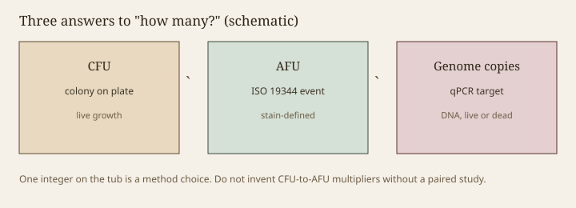

**Disclaimer.** Educational only. Not medical advice. Dietary supplements are not intended to diagnose, treat, cure, or prevent any disease (DSHEA; 21 U.S.C. § 321(ff); 21 CFR 101.93). A count method is not a health claim.

"50 billion CFU" is the most confident-looking number in the aisle. It is also, often, the least examined. Colony-forming units are a plate-count idea: cells (or clumps) that can grow into a colony under a defined medium, atmosphere, and time. Active fluorescent units are a flow-cytometry idea (ISO 19344 / IDF 232): particles that take up stains in a way the method calls intact or active. Genome copies are a qPCR idea: DNA targets, living or dead. If you switch methods without saying so, you can keep a large integer while the object changes. Hill's "adequate amounts" cannot survive that switch.

> **Photo:** Three boxes — colony on a plate / fluorescence event / PCR amplicon — with "not equal" between them.
> **Caption:** Three answers. One number on the tub is a choice.
> **License note:** Original schematic.

<figure class="blog-figure">
  
  <figcaption><strong>Figure.</strong> Three measurement objects; one integer on the tub is a method choice, not interchangeable units. <em>Original schematic; not clinical data or a product claim.</em></figcaption>
</figure>

## CFU: useful, moody, still the trial's language

Most human studies that bother to dose in live cells still speak CFU. That is why a finished-product file that wants to inherit a trial should speak CFU too, in the same matrix, with a method that a second lab can run. Moodiness is real. Clumping under-counts. Stressed cells that would revive in a person may not colony on a harsh plate. Anaerobes die in the air while the technician is kind. Medium choice is a silent author. None of that makes CFU mystical. It makes a method section mandatory.

Part 111 does not anoint a single probiotic plate method. It does require that you have a scientifically sound test for the spec you claim. If the spec is "30 billion CFU through end of shelf," the test has to be about *that*, not about a supplier's in-process number (draft 14).

## AFU: faster, and a different object

Flow cytometry can be faster and can see cells that plates miss. ISO 19344 exists because dairy and starter labs needed a standardized language for "intact" versus "damaged" lactic acid bacteria. AFU is a good process-control tool. It becomes a consumer problem when a label prints AFU and a trial printed CFU, or when a house treats AFU as a free upgrade to a bigger-looking number. There is no universal multiplier. If someone hands you one, ask for the paired study on *this* isolate in *this* matrix. `[CITE NEEDED]` — and if they do not have it, do not print the multiplier.

Yeast and spore formers are not the lactic organisms the dairy ISO had in mind. A method written for *Streptococcus thermophilus* will lie about *Saccharomyces* or *Weizmannia* without anyone meaning to lie (drafts 17–18).

## Genome copies: the dead-soup temptation

qPCR is specific and sensitive. It will happily count a heat-killed preparation. That can be the right tool for a postbiotic identity test (draft 23) and the wrong tool for a probiotic dose. If the carton says CFU and the COA's "potency" line is a PCR Ct, the file is arguing with itself. Draft 43.

Metagenomic read counts from a stool kit are a fourth object. They are relative, database-bound, and not a dose at all (draft 04). Do not let a dashboard's "low *Bifidobacterium*" become a CFU conversation.

## Clumps, chains, and the billion that was a chain

Streptococci and some lactobacilli chain. One colony can be many genomes. Some houses sonicate or treat to break chains before plating; some do not. Two honest labs can differ by a factor that would look like fraud if you did not know the method. Write the method. Keep it still between the stability study and the release test. Changing the method mid-dating period is how a product "gains" CFU without gaining cells.

## What to print, if you print a number

Print the unit, the method family, the time point (end of shelf), and the matrix. Print one number you can defend, not a manufacture-day banner and a footnote. If you use AFU, say AFU. If you use CFU, say the atmosphere and the medium family on the COA, not on the front of the pouch if it will not fit — but *have* it.

Adequate, in Hill's sentence, is a dose that was studied. The count method is part of the dose. A carton that changes the method has changed the dose. That is the whole essay, with less poetry than the aisle wants.

<!-- expand -->
## A worked example without fake digits

A trial administers a capsule labeled 10¹⁰ CFU of a named isolate, plated on a named medium in anaerobic jars. The carton two years later prints "50 billion AFU" from a flow method calibrated on a different isolate, or "50 billion genomes" from a qPCR on a powder that sat hot. The integers got larger. The object got less like the trial. Adequate, in Hill's sentence, shrank.

A second example: a mix lists eleven names and one CFU. The plate cannot separate them. One isolate dies. The integer holds because a hardy cousin grew. The label still lists eleven. Draft 15 is that story in marketing clothes.

## What to put on a COA line

Unit, method family, atmosphere, medium or stain, time point, matrix. If that will not fit the pouch, it still has to fit the COA (draft 43). Changing the method mid-dating period to "gain" CFU is a process deviation wearing a celebration.

ISO 19344 is a dairy-and-lactic document. Cite it for AFU when the organism matches. Do not wave it at a yeast or a spore and hope. Drafts 17 and 18 are the kingdom-and-form versions.

## A sentence for counsel

The count method is part of the dose. A carton that changes the method has changed the dose. A carton that changes the time point has changed the dose. A carton that changes the matrix has changed the object. Those three sentences are why this essay exists next to drafts 14 and 15.
