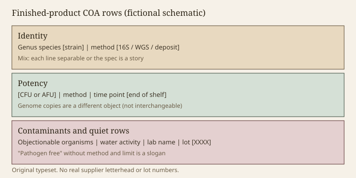

**Disclaimer.** Educational only. Not medical advice. Dietary supplements are not intended to diagnose, treat, cure, or prevent any disease (DSHEA; 21 U.S.C. § 321(ff); 21 CFR 101.93). This is a reading habit for a document. It is not a lab method and not a certification.

A certificate of analysis is a lot’s report card. For a vitamin, the interesting rows are identity, potency, and a contaminant list. For a live microbe the same nouns apply, and they are easier to fake with a neighbor’s paper. Part 111 wants finished-product testing against specs you actually claim. A supplier’s input COA is a receiving document. It is not the lot in the bottle after a Houston summer (draft 14). The sister supplements pack teaches general COA literacy. This essay is the live-cell addendum.

> **Photo:** A redacted row list: identity / potency (unit + method + time point) / objectionable organisms / water activity.
> **Caption:** If a row is missing, the card is a brochure.
> **License note:** Typeset mock. No real lot numbers. No third-party letterhead you do not own.

<figure class="blog-figure">
  
  <figcaption><strong>Figure.</strong> Bracket placeholders only; if a row is missing on a real PDF, the card is a brochure. <em>Original schematic; not clinical data or a product claim.</em></figcaption>
</figure>

## Identity

Genus, species, **strain**, and the method. 16S alone is often a neighborhood (draft 04). After Zheng 2020, the printed binomial may be a dialect (draft 08). A deposit number is how a second lab retrieves the object (draft 16). If the product is a mix, identity is each isolate, not a blended 16S soup (draft 22). If the product is killed, identity is still the organism that was grown, plus confirmation that plates are zero (draft 23).

"Matches the reference chromatogram" is not a sentence that applies to a cell. If you see it, you are holding the wrong template.

## Potency

Unit (CFU, AFU), method family, atmosphere, medium, and **time point**. End of shelf is the consumer number. Manufacture is a process control. Genome copies are a different object (draft 13). A multiplier from AFU to CFU without a paired study is theater. For mixes: can they enumerate each line? If not, the spec is a story (draft 15).

Yeast and spores need methods that are not a lactic SOP (drafts 17–18). Anaerobes need more than a hopeful chamber photo (draft 20).

## Contaminants and the quiet rows

Objectionable organisms. Pathogen screens appropriate to the process. Heavy metals if the process and the channel require them. Allergens from media. Water activity for a dry product — the number that predicts death in the dating period. Residual moisture. For coated products, a dissolution or a "cells recovered from coat" note (draft 42).

"Pathogen free" without a method and a detection limit is a slogan. "Heavy-metal free" is the same slogan in a different aisle.

## Whose lab

First-party, supplier, or a named third party. ISO 17025 is a competence of a lab, not a blessing of a SKU. A house that will not name the lab is asking you to trust a PDF’s font. Lot number on the COA should match the lot on the bottle. Date of test versus date of fill versus expiry: if those three cannot sit in a sentence, the card is confused.

## What this pack will not do

We will not publish a real COA. We will not invent pass/fail numbers. We will not treat a USP or NSF mark as present unless a named lot is in that program (CLAIMS_GUARDRAILS). We will treat a missing strain ID as a failed identity row even if the potency integer is large.

Draft 44 is the last page: eight questions that restack this entire folder into a file you can hold before anyone writes "microbiome" on a carton.

<!-- expand -->
## Time points that have to sit in one sentence

Date of fill, date of test, expiry. If those three cannot sit together, the card is confused. A test on input blend is a receiving document. A test on finished product at expiry is the consumer fact (draft 14). Lot on the PDF must match lot on the bottle. A house that will not name the lab is asking you to trust a font. ISO 17025 is a lab competence, not a SKU blessing.

## Mixes, kingdoms, coats

Can they enumerate each line (draft 15). Yeast and spore methods are not a lactic SOP (drafts 17–18). Anaerobes need more than a chamber photo (draft 20). Coated products need a recovery method (draft 42). Killed products need a zero plate plus a new potency unit (draft 23). After Zheng 2020, the printed binomial may be a dialect (draft 08). A deposit is how a second lab retrieves the object.

## What we will not publish

A real COA. Invented pass/fail numbers. A USP or NSF mark unless a named lot is in the program. We will treat a missing strain ID as a failed identity row even if the potency integer is large. "Pathogen free" and "heavy-metal free" without method and limit are slogans. Draft 44 restacks this folder into eight questions a buyer can hold.

<!-- expand2 -->
## A ten-minute lot check

Lot matches bottle. Fill date, test date, expiry can be said in one sentence. Identity has strain and method, not a vitamin-style chromatogram template. Potency has unit, method, time point. Mix lines are separable or the spec is a story. Kingdom-appropriate method. Zero plate if killed. Recovery if coated. Water activity if dry. Lab named. No "free" slogans without method and limit. Missing strain ID fails identity even if the integer is large.

The sister pack teaches general COA literacy. This is the live addendum. Draft 44 is the eight questions that restack the folder.

<!-- expand3 -->
## Pocket card

Ten-minute lot check: lot matches; fill, test, expiry sit in one sentence; identity has strain and method; potency has unit, method, time point; mixes separable; kingdom-appropriate method; zero plate if killed; recovery if coated; water activity if dry; lab named; no "free" slogans without method and limit. Missing strain ID fails identity even if the integer is large. Input sheets are receiving documents. The sister pack teaches general COA literacy. This is the live addendum. Draft 44 restacks the folder into eight questions.
