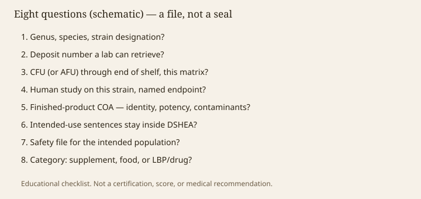

**Disclaimer.** Educational only. Not medical advice. Dietary supplements are not intended to diagnose, treat, cure, or prevent any disease (DSHEA; 21 U.S.C. § 321(ff); 21 CFR 101.93). This checklist is not a certification, a score, or a recommendation to buy or to swallow anything.

Forty-three drafts in this folder have been a refusal to let a prefix do a file’s work. Here is the file, restacked as eight questions. They are Binda 2020 and Hill 2014 written as a founder’s afternoon, plus the US box-picking problem (draft 38). A "no" is not a moral failure. It is a smaller vocabulary: live cultures, a named isolate, a fermented food, a research organism, a heat-killed preparation, a drug candidate. Smaller is how this pack stays educational.

> **Photo:** The eight-question schematic.
> **Caption:** A file. Not a seal, not a grade, not a protocol.
> **License note:** `assets/buyers-eight-questions/eight-questions.svg`

<figure class="blog-figure">
  
  <figcaption><strong>Figure.</strong> A buyer file, not a certification mark, grade, or medical recommendation. <em>Original schematic; not clinical data or a product claim.</em></figcaption>
</figure>

## 1. Genus, species, strain designation?

If you only have a genus, you have a neighborhood (drafts 08, 16, 19). If you have a "clinically studied blend," you probably have a neighbor (draft 15). After 2020, the old *Lactobacillus* word is a dialect.

## 2. Deposit number a lab can retrieve?

ATCC, DSM, CNCM, or another collection that will ship the object. House numbers that never leave the house are how evidence dies when a CMO changes. GG is the teaching case (draft 16). De Simone is the mix case (draft 22).

## 3. CFU (or a named unit) through end of shelf, this matrix?

Manufacture-day integers are process controls (draft 14). AFU and genome copies are other objects (draft 13). Gummies, coatings, and Houston are part of the matrix (drafts 14 and 42). Mixes must still be enumerable (draft 15).

## 4. Human study on this strain (or this mix), named endpoint?

Cages do not count (draft 11). 16S shifts are not a benefit unless you locked why (drafts 04 and 07). Disease endpoints are the other box (drafts 10, 36–38). Funding weather belongs in the reading (draft 12). If the interesting arm is pasteurized, you have left "live" (drafts 21 and 23).

## 5. Finished-product COA — identity, potency, contaminants?

Supplier input sheets are receiving documents (draft 43). Methods have to match the organism’s kingdom and breathing habits (drafts 17, 18, 20).

## 6. Intended-use sentences stay inside DSHEA?

Guideline rows, Reels, kit PDFs, and "prevents" all count (drafts 10, 31, 37). Structure/function still wants substantiation and 101.93. FTC 2022 still reads the banner. "Dysbiosis," "psychobiotic," and "lean microbe" are how nouns go bad (drafts 06, 33, 34).

## 7. Safety file for the intended population?

Genome and resistome, QPS-if-you-mean-Europe, no "safe for everyone," no NICU prestige (drafts 36 and 41). New isolates need the NDI/GRAS conversation before the listing (draft 40).

## 8. Category: supplement, food, or LBP/drug?

Hill’s word does not pick the box. Intended use does. Vowst is not a cousin in a tub (drafts 37–38). EFSA and FOSHU do not move Maryland (draft 39).

## What this file will not become

It will not become a score. It will not become "our eight-point certified microbiome standard." It will not name a science partner who does not exist. It will not turn a yes on eight questions into a disease claim. It will not tell a reader to start a product.

If you are an editor, this is the last piece you import in wave 6, after the definitions and the walls. If you are a founder, it is the first piece you read, then you go back to 01 and 38. If you are a reader who came for a shopping list, there is not one. There is a research map, a statute, and a habit of asking what the paper actually measured. That was the assignment. The cart was never the assignment.

<!-- expand -->
## How to use the eight without turning them into a seal

Walk them in order. A no on 1 or 2 stops the Hill word. A no on 3 stops "adequate." A no on 4 stops "benefit." A no on 5 stops the lot. A no on 6 stops the website. A no on 7 stops the population. A no on 8 stops the box. Do not average the eights into a score. Do not print "eight-point certified." Empty seats for science/QA and counsel stay empty (CLAIMS_GUARDRAILS).

If you are a founder, start here, then read 01 and 38. If you are an editor, import this last in wave 6. If you came for a shopping list, there is not one.

## What a "yes" still is not

It is not a disease claim. It is not medical advice. It is not a reason to start a product. It is not a psychobiotic or a lean-microbe license (drafts 33–34). It is permission to use a smaller, checkable vocabulary about a live article of commerce — or to admit you have a food, a research organism, or a drug candidate instead.

## The assignment, restated

Teach how the research is built. Guard the claims. Keep a human voice. Stage the reading so definitions and walls arrive before organisms and carts. Forty-four drafts is a shelf, not a week of WordPress (INDEX.md). The cart was never the assignment. The file was.

<!-- expand2 -->
## Import order, one more time

Wave 1 definitions and methods. Wave 2 how to read a trial. Wave 3 organisms as teaching cases, not a catalog. Wave 4 prefixes and foods. Wave 5 kits, myths, hospital rooms. Wave 6 law, QC, this file. If staging can only hold six pieces, hold 01, 08, 10, 37, 38, 44 (INDEX.md). Do not dump forty-four onto a live sitemap (WP_IMPORT.md).

A yes on eight questions is still not a reason to swallow anything. It is permission to speak more carefully, or to admit the smaller noun. The cart was never the assignment. The file was. Counsel and science/QA remain empty seats.

<!-- expand3 -->
## Pocket card

Walk 1-8 in order. Do not average into a score. Do not print a house seal. Empty seats stay empty. Wave import: 01, 08, 10, 37, 38, 44 if staging can only hold six. A yes is not a swallow instruction and not a disease claim. Smaller nouns when a no appears: live cultures, named isolate, fermented food, research organism, inactivated preparation, drug candidate. Definitions and walls before organisms and carts. Forty-four drafts are a shelf, not a week of WordPress. The cart was never the assignment. The file was.
