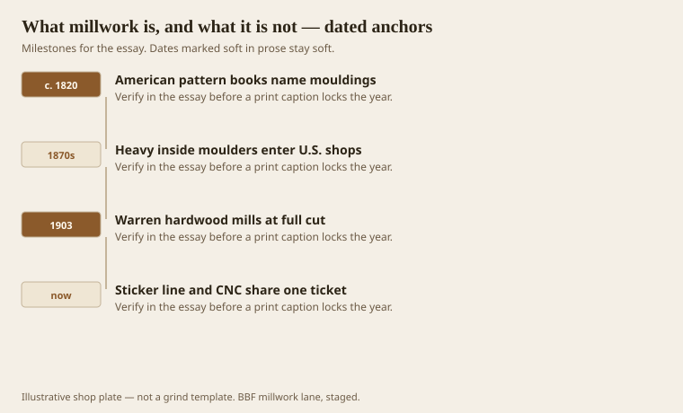
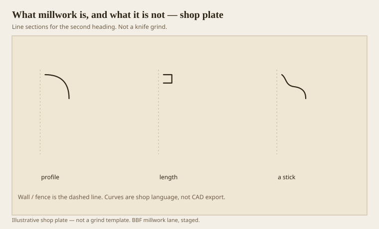

**Disclaimer.** Educational history and shop practice for the BBF millwork lane. Not a construction specification, not a bid, and not architectural or engineering advice. A measured opening and the local code beat a magazine essay.

People use *millwork* the way they use *nice*. It covers a stair, a crown, a nurse-station top, and a whole sawmill if the speaker is standing in the parking lot. In a shop the word is narrower. Millwork is wood (or a wood stand-in) run to a repeating section and sold by the foot, or cut to a drawing and sold by the each, for a building. The section is the point. A 1x6 ripped from a kiln pack is lumber. The same 1x6 after a moulder has put a cyma and a fillet on it is millwork. A table that uses that stick as an apron has left millwork and entered furniture. The joint is the border.

This series lives in that middle country. Bradley Brand Furniture grew up next to it — Warren, hardwood, a planer mill that could still take a linear run — but the essays are not a catalog. They are about the language a shop uses when a room still wants an order, and about the machines that made that language cheap enough to waste.

## Three words that get borrowed

<!-- graphics-pack:v1 -->

*Figure 1. Four dates a shop can argue about — pattern books, moulders, Warren’s cut, and the split ticket.*

A *mill* saws or planes. In south Arkansas that meant a daily board-foot number and a whistle. Bradley Lumber, Southern Lumber, and Arkansas Lumber were mills in that sense: log deck, head rig, kiln, planer. Postcard language from Bradley Lumber still says the quiet part — oak and other native hardwoods, furniture stock, pine millwork, mixed cars. Millwork left those sheds as a product line, not as a philosophy.

A *millwright* hangs shafts and sets machines. The word is older than the furniture shop. If you ask a millwright for a crown, you will get a look. If you ask a millwork shop for a new gearbox, you will get another.

*Architectural millwork* is the fussy cousin: standing and running trim, doors, frames, stairs, sometimes casework, made to a drawing that an architect will initial. AWI lives here. Stock moulding from a merchant yard is millwork too, just millwork that already lost the argument with a catalog number. Custom work is millwork that still has a grind date on the knife.

The 19th century is when the three words started sharing a parking lot. Tompkins, writing in 1889, treated the planing mill as a plant that had absorbed the old hand-moulding shop. A man who could strike a quirked ogee with a pair of hollows and rounds was not unemployed the day the sticker arrived. He was expensive. The machine made the same section a hundred feet at a time, and architects, Tompkins said, got pickier because they could. That sentence is still true. Cheap footage raises the standard of the drawing, then someone tries to meet the drawing with a cheaper stick. The cycle is the trade.

Figure 1 hangs four hooks. American pattern books — Benjamin in Greenfield, later Boston — named the sections for people who would never see Rome. Heavy inside moulders show up in the American advertising of the 1870s; the lineage is Fay, Rogers, Woods, Smith, the usual New England and New York names. Warren’s big cut is a 1903–1907 fact in the county histories, not a brand story. And now a shop that still has a moulder also has a CNC. The ticket has to say which machine eats the hours. If it does not, the estimator invented a third machine called hope.

## A stick, a profile, a length

<!-- graphics-pack:v1 -->

*Figure 2. Three words you can hold: a profile, a length, a stick. The dashed line is the wall or the fence.*

Hold a piece of crown. The back is two rabbets, or two flats, that want a wall and a ceiling. The face is a conversation about shade. The length is whatever the kiln and the moulder left you after you cut out the pith and the shake. That object is millwork. Figure 2 is a reminder to keep the three words from collapsing. A profile without a length is a router bit. A length without a profile is a board. A stick that is neither is firewood.

Furniture uses millwork and then hides the fact. A bed post can be turned on the same day a newel is turned. A butcher-block top can leave the same glue room as a nurse-station transaction counter. The difference is the drawing and the code. Furniture answers a body. Millwork answers a building. Healthcare casework in this lane sits on the fence: it is FF&E on the purchase order and millwork on the floor, because the edge has to take a gurney and a bleach rag. We will get to that. The definition still holds. Repeating section, or a part cut to a building drawing.

People also say *trim* as if it were an insult. Trim is millwork that got installed. If the cope is right, nobody calls it art. If the cope is wrong, they call it trim and they mean it.

A last confusion, because it costs money. *Linear millwork* is footage: base, casing, crown, chair rail, panel mould. You grind once, you run, you waste a first stick, you sell the rest by the foot. *Each* is a newel, a radius head, a fluted pilaster that is not worth a moulder setup. CNC and a shaper live on the each side. A shop that prices a 400-foot base run as if it were forty CNC parts will not see the second job. A shop that tries to moulder a one-off radius will not see Friday.

The rest of this pack is history because the sections are history. Greek quirks, Roman circles, a gorge from a temple wall, a Victorian SKU, a ranch-house 2-1/4 sprung crown that taught a generation the cornice was optional. And shop practice, because a knife that is a thousandth long is a history lesson you can feel with a thumbnail. We are not going to sell you a room. We are going to name the parts so the room can be argued with.
