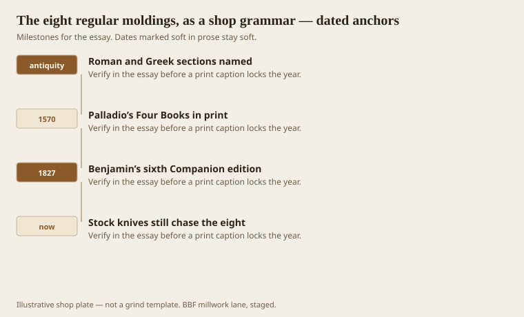
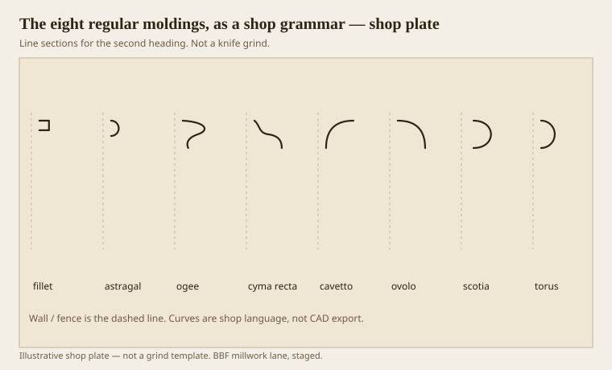

**Disclaimer.** Educational history and shop practice for the BBF millwork lane. Not a construction specification, not a bid, and not architectural or engineering advice. A measured opening and the local code beat a magazine essay.

A merchant-yard rack is not a language. It is a pile of numbers. WM 47, WM 366, a crown that is “the 3-5/8,” a clamshell that has no name except the price. Asher Benjamin, who had to teach country builders from copperplates, did not start with numbers. He started with eight regular mouldings and a sentence about work. The ovolo and the ogee are strong at the ends, so they can support. The cyma recta and the cavetto end in a point, so they cover and they shed. The torus and the astragal are ropes; they bind. The fillet and the scotia separate and keep two convex members from turning into one blob. That is a grammar. You can break it. You should know you are breaking it.

Hatfield, later, in *The American House Carpenter*, still counted eight and still gave the old names: fillet or listel, astragal, scotia, ovolo, cavetto, cyma recta, cyma reversa. The Latin is not snobbery. It is how you tell a knife grinder you want a covering wave and not a supporting one. If you say “that S-shaped one,” you will get whichever S was on the bench.

## Benjamin’s eight, and why they have jobs

<!-- graphics-pack:v1 -->

*Figure 1. From named antique sections to a stock rack that still chases the same eight.*

Palladio’s 1570 books are the Italian grandfather. He drew Roman circles because Rome was what he could measure. The names were already old: *ovolo* from *ovum*, the egg; *cavetto* from a hollow; *scotia* from darkness; *cymatium* from a small wave. A shop in Warren does not need to love Venice. It needs to know that a covering member and a supporting member are not interchangeable just because both look “fancy” on a phone.

Benjamin’s 1827 Companion — the sixth edition, seventy plates — is the American desk copy. He is not inventing the eight. He is telling a joiner why the eight exist, and he does not forget water. The cyma recta and the cavetto, he says, have outlines opposed to falling water, so the water must drop. That is an eave sentence that still applies to an interior cornice. Gravity is a habit. A profile that would hold a drip on the outside will hold dust on the inside. A profile that sheds will throw a shadow the way it once threw rain.

Figure 1 is a short spine, not a family tree. Antique sections get names. Palladio prints. Benjamin writes for people who will grind irons in Greenfield and points west. And a modern rack still sells quarter-rounds, coves, ogees, and a half-round it calls a “half-round.” The jobs did not retire. The catalog forgot to print them.

When a designer stacks three ovolos and calls it a bedmould, Benjamin would not be shocked. Greek Revival houses in Virginia did that with quirked ovolos until a mantel looked like a small cliff. The grammar allows emphasis. What it does not allow is a cavetto asked to hold a corona. The hollow ends in a point. It will not look like it is carrying anything, because it is not. Your eye knows before your mouth does.

The other failure is the missing separator. Two torus-shaped members butted together read as a sausage. A fillet, even a sixteenth, makes two members. A scotia makes a black line. Cheap stock often skips both because a fillet is a second knife and a scotia is a third. Then someone caulks the confusion.

## A plate of eight sections

<!-- graphics-pack:v1 -->

*Figure 2. Eight regular sections, wall at the dashed line. Jobs first, catalog numbers later.*

Figure 2 is the alphabet. Read it left to right the way Benjamin listed them, more or less: fillet, astragal, ogee, cyma recta, cavetto, ovolo, scotia, torus. The dashed line is the wall, or the fence of the moulder, or the arris you are measuring from. None of these paths is a grind. A grind needs a cutting circle, a hook, and a piece of M2 that has been balanced. This is the talk that happens before the grind.

A useful shop test: take a room that already has trim and name each member by job, not by receipt. The base cap is usually an ogee or an ovolo — a support sitting on a die. The shoe is a small torus or a bead pretending to be a scribe. The casing may be a cluster: fillet, ovolo, fillet. The crown, if it is honest, still wants a covering cyma, a flat corona, and a supporting bedmould. If the crown is a single timid cove, you are looking at a covering member asked to do a whole entablature. It will look like a room that lost its roof.

Paint-grade poplar will take all eight. Stain-grade red oak will take them if the hook is right. MDF will take a painted version of all eight and then swell at the first wet mop if you used it as a base in a healthcare corridor. The grammar does not care. The material does.

We will spend later essays on single members. This one is only the rule that they are not ornaments sprinkled on a box. They are verbs. Support, cover, bind, separate. A profile that cannot say which verb it is doing is a doodle. Doodles are allowed. They should be priced as doodles, not as “traditional millwork.” Traditional, here, means the eight and the jobs. Everything else is a dialect. Dialects can be good. They still have to parse.
