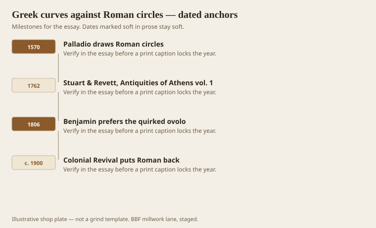
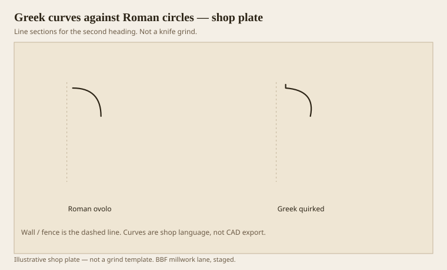

**Disclaimer.** Educational history and shop practice for the BBF millwork lane. Not a construction specification, not a bid, and not architectural or engineering advice. A measured opening and the local code beat a magazine essay.

If you only remember one fight in this pack, remember this one. A Roman moulding is a piece of a circle. One center, one radius, a clean compass job on the bench. A Greek moulding is a piece of an ellipse or a parabola, and it often turns back in at the top, leaving a little dark notch called a quirk. The Roman section looks calm from across a piazza. The Greek section looks sharper from five feet, which is where a chair sits. Robert Adam said he even bent the Greek curves further for interiors, because objects near the eye ought to be softened — his word — which in practice meant more curve, not less edge.

Until 1762 most English and American joiners were Roman whether they knew the word or not. Palladio, Vignola, Scamozzi, then Gibbs and Swan: single-radius cyma, quarter-round ovolo, quarter-hollow cavetto, half-round torus. Greece was Ottoman. The stones were not a weekend trip. Then Stuart and Revett published the first volume of *The Antiquities of Athens*, and the shop problem changed.

## When the books changed the knives

<!-- graphics-pack:v1 -->

<figure class="millwork-figure">

<figcaption>Figure 1. Palladio draws Roman circles through Colonial Revival puts Roman back — see “When the books changed the knives.”</figcaption>
</figure>

Calder Loth, writing for the Institute of Classical Architecture & Art, walks this as a historian. The short version for a grinder is: you cannot strike a Greek ovolo with the same iron you used for a Roman one. A quirk is a second idea. It is a small reverse that makes a hairline of shadow between the curve and the member above. Benjamin, already in the 1806 Companion, printed a plate to show that a quirked ovolo could be a third taller in effect without gaining the height, or a third shorter without looking starved. He also claimed a lighter cornice could look nearly as tall as a heavier Roman one when seen at forty-five degrees, which is how you see a cornice if you are standing in a room and not lying on the floor. `[VERIFY]` the fractions against the plate if you are going to grind from them. The argument is the thing: Greek sections buy contrast.

Adam was early and personal about it. In the 1778 *Works* he said Roman mouldings were less curvilinear than Greek, and that he preferred the Greek, especially inside. His Lansdowne order is a mix — a Roman-ish ovolo on an abacus that is trying to be Greek — but the quirk shows up where he wants a line. American Greek Revival, twenty and forty years later, is less polite. Country mantels in Virginia stacked quirked ovolos until the shelf sat on a little cliff of arrises. Lafever’s plates, cribbed from Stuart and Revett, gave cover.

Then fashion turned. Colonial Revival, from the Centennial generation into the catalog house, put Roman circles back. A quarter-round is easy to grind, easy to stock, easy to paint. The quirk looked “old Greek” in a way that 1920 did not want. A lot of what a yard calls “colonial casing” is that undo: single-radius, no hairline, a polite blob.

Figure 1 is the pendulum. If a restoration job is 1840 in the South, look for the quirk before you buy a colonial knife. If the house is 1928, the Roman circle may be the honest match even if your eye prefers the Greek. The house already voted.

## Quirked ovolo against a quarter-round

<!-- graphics-pack:v1 -->

<figure class="millwork-figure">

<figcaption>Figure 2. Profile plate for “Quirked ovolo against a quarter-round.” Line sections, not a grind.</figcaption>
</figure>

Figure 2 is the whole essay in two paths. The Roman ovolo leaves the wall and arrives at the fillet in a quarter circle. Sun on it is even. Shadow under it is a soft pad. The Greek ovolo starts, leans, and tucks. Sun on it makes a bright upper edge. The quirk goes black. Benjamin said as much in 1827: the Roman ovolo will not be as bright at the top, nor make as beautiful a line of distinction when it is in shadow and lit by reflection. He was selling plates. He was also right about light. Millwork is a lighting instrument. Anyone who has set a crown under a can light and a crown under a window knows it.

On a moulder the difference is a grind and a side-clearance problem. A quirk is a thin fin of steel if you are greedy. It wants a hook that will not chatter and a feed that will not blow the fin out of red oak. Paint-grade poplar is forgiving. That is why so much “Greek” new work is poplar: the quirk survives. Stain-grade oak will show every rub. If the owner wants the hairline in oak, budget the shear head and the second stick.

A router quarter-round bit is a Roman ovolo with a pilot bearing and a short memory. It will not give you a quirk. People ask for “something more interesting” and then buy the bit because it is in the drawer. That is how rooms get bland. Interesting, here, is not a scroll. It is a line of darkness the width of a pencil lead.

The rest of the pack will keep returning to this split. Cyma, ogee, echinus, panel mould — each has a Roman version and a Greek version. Learn to see the quirk and you can date a room without a plaque. Lose the quirk on a matching job and the new stick will look like it came from a different century, because it did.
