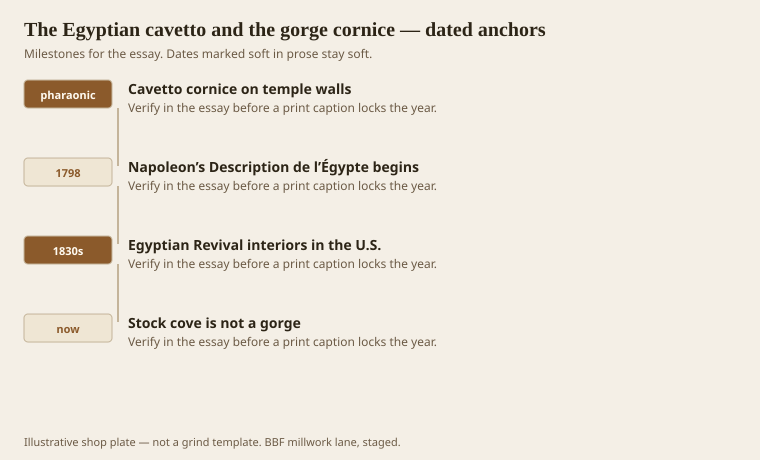
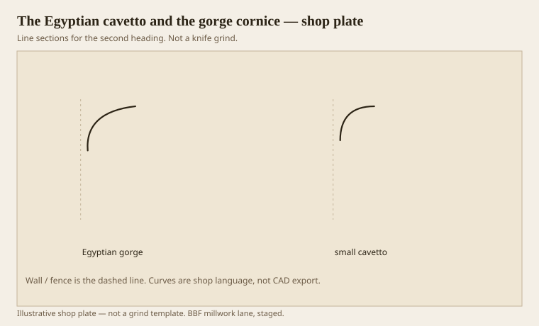

**Disclaimer.** Educational history and shop practice for the BBF millwork lane. Not a construction specification, not a bid, and not architectural or engineering advice. A measured opening and the local code beat a magazine essay.

Before a Greek echinus learned to quirk, Egyptian walls ended in a hollow that could throw water. The cavetto cornice — the gorge — is a large concave flare, often with a torus below it like a rope under a gutter. It is not a delicate interior toy. It is an eave idea in stone. When 19th-century Europe and America caught the Egyptian fever after Napoleon’s scholars started publishing the *Description de l’Égypte* (from 1809; the campaign was 1798), the gorge came indoors as a fashion. Most of what a yard now sells as “cove crown” is a shy grandchild of that hollow, stripped of the torus and the scale.

Benjamin would still call a cavetto a covering member. It ends in a point. It does not hold a corona. It sheds. On a temple that is rain. In a room that is shadow. The 1911 Britannica, which is dry in the useful way, notes that the classic cavetto is small compared with the Egyptian one. That size difference is the whole shop problem. A 3/4 cove in a bathroom is a cavetto. A gorge is a hollow you can put your fist in.

## A hollow older than the orders

<!-- graphics-pack:v1 -->

*Figure 1. Temple hollow, Napoleonic plates, American Revival rooms, and the stock cove that forgot the gorge.*

Dating a first cavetto is a fool’s errand in a millwork essay. The form is pharaonic, repeated on pylons and shrine walls for centuries. `[VERIFY]` any specific temple you want to name in a caption; this plate is the type, not a site report. What matters for a later shop is the afterlife. French plates put the gorge in libraries. English and American architects put it on cemetery gates, medical-college doorways, and the occasional parlor that wanted to feel like a Nile that had never seen Arkansas.

Egyptian Revival in the United States is a thin, real layer: 1830s furniture and interiors, later 1920s movie palaces and Masonic rooms, the occasional storefront. It is not the Greek Revival, which owned whole towns. You will not find a gorge on every Warren house. You will find the idea every time a designer asks for “a big cove, but dramatic.” Dramatic means scale and a hard line at the lip. A stock sprung cove is neither. It is a covering member asked to replace a cornice, which we will beat up in the ranch-house essay.

The torus under an Egyptian cavetto is not decoration. It is the rope that makes the hollow readable. Lose the torus and the flare dies into the wall. A lot of “Egyptian-inspired” foam cornice does exactly that. Foam is not this lane. The lesson still holds in poplar: if you want the gorge, budget a torus or a bead at the bottom, and give the hollow enough height that the shadow goes black. Scotia got named for darkness. The gorge is darkness at architectural scale.

Figure 1 ends on the stock cove because that is the living fossil. People buy it by the foot and wonder why the ceiling still looks like a lid. The ancestor was an eave. The descendant is a strip.

## Gorge against a small cove

<!-- graphics-pack:v1 -->

*Figure 2. A large gorge flare beside a timid cavetto. Same family, not the same job.*

Figure 2 is a scale lesson. The small cavetto is the classic covering hollow, the one Benjamin pairs with a cyma recta as a lid. The gorge is the same verb shouted. On a moulder you will not run a true temple flare in one stick unless the ceiling is a warehouse. You build it: a wide cove, a fascia, a torus. Or you admit you are making a cove crown and stop using the word Egyptian.

Healthcare and hospitality work in this lane sometimes wants a “soft cove” at a ceiling for cleanability and a calmer corridor. That is not a gorge. Do not sell it as one. A radius that a rag can follow is a maintenance profile. A gorge collects dust in the upper lip if you cheapen the paint. Know which client you have.

Wood movement is uglier on a large hollow than on a small one. A cove that wide, in solid stock, will telegraph cup. Finger-joint pine, well primed, is a common cheat. MDF will hold the paint film and then swell at the joints if the corridor mop is sincere. In the South, sincere is the default in August. If the hollow is stain-grade oak, think about staves or a built-up, not one wide board trying to be a temple.

A last practical: the lip of a gorge wants a crisp arris. If you sand it into a radius because the painter asked for “no sharp edges,” you have cancelled the shadow. Healthcare specs sometimes require a radius for injury. Then you do not get a gorge. You get a cove with a radius, and you say so on the drawing. Honesty is cheaper than a punch list that says the crown looks dull.

The orders did not invent the hollow. They domesticated it. When a room wants something older than Greece, this is the member. When a room wants a $1.89 cove, that is also a member. They should not share a name on the quote.
