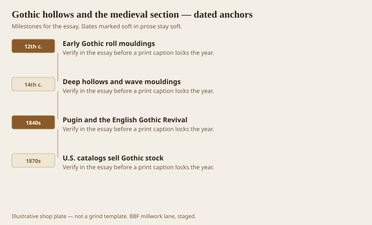
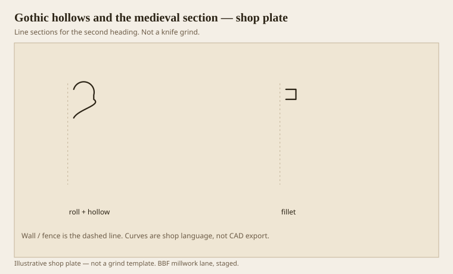

**Disclaimer.** Educational history and shop practice for the BBF millwork lane. Not a construction specification, not a bid, and not architectural or engineering advice. A measured opening and the local code beat a magazine essay.

Classical mouldings pose for the sun. Gothic mouldings swallow it. A medieval arch section is a sequence of rolls and hollows that take a raking light and turn it into a ladder of dark. The 1911 Britannica, again useful because it does not care about your mood board, treats Gothic as another system, not as a broken Roman. If you grind a Tuscan cyma and call it a church, you have lied to the nave.

Pugin, in 1841, wanted pointed architecture to be a moral fact. A millwork shop can leave the sermon on the bench and still take the principle: the section should belong to the construction. A Gothic hollow is not a cyma that got depressed. It is a channel cut to make a line of shade along a jamb that is already doing structural work in stone, or pretending to in wood.

American catalogs in the 1870s sold “Gothic” stock the way they sold everything — as a number. Some of it is honest: a roll, a deep hollow, a fillet. Some of it is a pointed arch stuck on a Roman door. The second kind is how parlors got confused.

## Hollows that swallow light

<!-- graphics-pack:v1 -->

*Figure 1. Early rolls, deep later hollows, Pugin’s revival, and the catalog Gothic stick.*

Early Gothic (12th century in the usual textbook) likes a roll moulding — a three-quarter circle sitting in a recess — and a modest hollow. Later medieval work, especially 14th-century English, deepens the hollows and adds wave mouldings, the kind of compound that looks like a cyma until you notice it is chasing a different rhythm. `[VERIFY]` a specific cathedral section before you put a building name in a print caption. This essay is about the family, not a measured bay at Amiens.

When the Gothic Revival hit English and then American interiors, the shop problem was scale. A stone hollow two feet deep does not shrink into a 4-inch pine casing without losing the black. Pugin would rather you used fewer, truer members than a lot of skinny ones. That is still good grind advice. One deep scotia-like hollow with a roll beside it will read Gothic in a hallway. Six shallow waves will read as a busy Victorian door that could not decide.

Newlands’ carpenter plates, mid-century, sit in the same drawer as American practice: the joiner is now applying members, not always sticking them on the rail. Gothic Revival doors in the U.S. often have planted moulds and a pointed panel. The plant is fine. The section still has to go dark.

Figure 1 ends on the catalog because that is what a restoration job will hand you: a broken stick and a page from 1885. Match the hollow depth before you match the pointed marketing. Depth is the style.

## A roll, a hollow, a fillet

<!-- graphics-pack:v1 -->

*Figure 2. A roll-and-hollow family beside a fillet. Light is supposed to die in the channel.*

Figure 2 is not a measured medieval bay. It is the shop sentence: a roll (convex, almost a torus in a pocket), a hollow (the swallow), a fillet to keep them from smearing. If you cannot get the hollow black in the sample under a raking work-light, grind deeper or add a quirk at the lip. A timid hollow is a cove. Coves are classical covering members. Different church.

On the moulder, deep hollows are side-clearance country. The wheel has to be tilted or the sides of the knife rub, heat, and die. Oak will burn a brown line that stain will not forgive. Poplar will fuzz. A shear head helps. So does a second pass with a shallower knife if the hollow is a fist. Do not be a hero on a Monday with a single deep grind in red oak. The roll wants a clean land; if you joint it sloppy, one knife does all the work and the roll goes wavy.

Stairs and pews are where Gothic millwork still earns a living: a roll nosing is not a modern eased edge. A skirt with a hollow next to the tread can throw the same ladder of shade as a jamb. Code will have opinions about nosing radius and graspable handrails. `[VERIFY]` the jurisdiction. The style can survive a radius if the hollow behind it still goes dark.

Do not mix a Gothic hollow into a Greek Revival casing because the owner “likes both.” Both is a room that shouts in two languages. If the house is 1878 and already confused, match the confusion on purpose and write it on the ticket. Accidental bilingual trim is how punch lists get religious.
