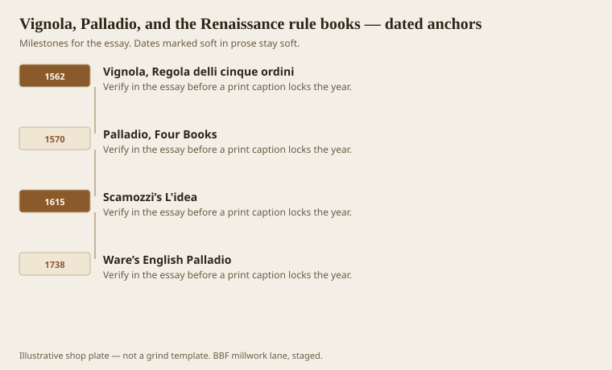
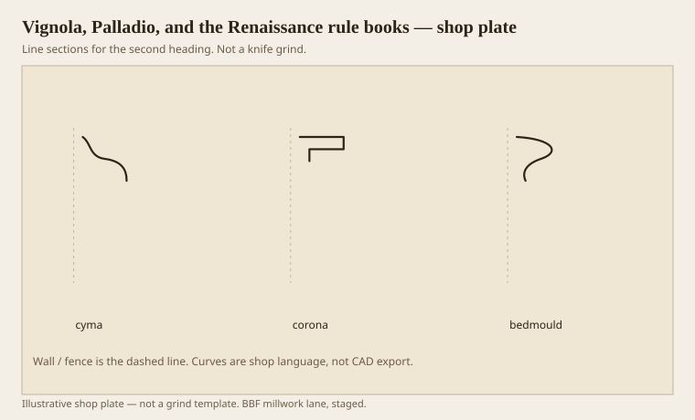

**Disclaimer.** Educational history and shop practice for the BBF millwork lane. Not a construction specification, not a bid, and not architectural or engineering advice. A measured opening and the local code beat a magazine essay.

A millwork shop does not need to love the Renaissance. It needs to know why a Tuscan cornice still shows up in a kitchen drawing as if someone in 1562 had an opinion about the fridge. Vignola’s *Regola* (1562) and Palladio’s *Four Books* (1570) turned the five orders into a measured kit. Scamozzi’s *L'idea* (1615) piled on. English plates — Ware’s Palladio in 1738 is the one Loth keeps pointing at in Jefferson country — carried the kit across the water. American joiners bought the English, not the Italian. The Latin names stuck because the plates stuck.

The orders are not five flavors of column. They are five coordinated sets of members: base, shaft, capital, architrave, frieze, cornice, and the mouldings that bind them. When you steal only the cornice, you are still stealing from a set. Gibbs later made that theft easy by giving interior fractions. Vignola and Palladio made the theft possible by drawing the set so clearly a joiner could copy a cyma with a compass.

## Who wrote the shop’s Latin

<!-- graphics-pack:v1 -->

*Figure 1. Vignola’s rule, Palladio’s books, Scamozzi, and Ware’s English Palladio.*

Vignola is the schoolmaster. The *Regola* is a thin, fierce book: modules, parts, a way to draw an order without inventing. Shops like a module. A module is a grind that scales. If the room is smaller, the parts shrink together. If you shrink only the crown and leave the base from another book, the wall looks like it was dressed by two uncles.

Palladio is the one Americans name. Jefferson named him. So did every Colonial Revival architect who wanted a porch to look like it had read a book. Palladio’s mouldings, as Loth reminds, are Roman circles — single radius — because that is what the ruins around him offered. If your “Palladian” kitchen has quirked Greek ovolos, someone mixed libraries. Mixing is allowed. Naming it wrong is how a match job fails.

Ware’s 1738 English Palladio is the carrier. Drayton Hall’s library held it. A mantel there follows the Roman rules the way a good shop follows a full-size section: not as mood, as instruction. Figure 1 is that relay. Italy draws. England translates. Carolina and New England cut.

A shop in the hardwood belt meets this tradition as a PDF from an architect who also sent a stock WM number. Those two files often disagree. The treatise wants a corona. The WM number has none. Decide which document is the contract before you grind. If the architect means Palladio, ask for a height as a fraction of the room and a three-part cornice. If the architect means the WM number, say so and stop printing the word Palladian on the quote. Words are finishes. They scuff.

## Tuscan cornice as three jobs

<!-- graphics-pack:v1 -->

*Figure 2. Tuscan cornice in three verbs: covering cyma, flat corona, supporting bedmould.*

Figure 2 is the smallest order doing the full sentence. Cyma on top (covering, once a gutter). Corona in the middle (the eave slab; the word *crown* lives here). Bedmould below (support, once a beam for rafters). Vignola and Palladio will enrich the cyma and the bed as you climb Doric, Ionic, Corinthian, Composite. They do not promote the corona out of the stack. Victorian designers sometimes flattened it or replaced it with a scotia to lift a ceiling. That is a later dialect. The Renaissance kit still wants the flat.

On a sticker you can fake this three ways. One: grind a single stick that includes a little soffit. Two: run three sticks and assemble. Three: run a cyma and a bed and let the drywall be the corona. Three is how cheap rooms lose the shadow. The soffit is the dark underside. No soffit, no crown, just a wave stuck in a corner.

Proportions: later essays will use Gibbs’s fractions because they are interior-friendly. The Renaissance books size an order from a column diameter. A drywall room has no column. You invent one (full order with pedestal, column plus plinth, or column alone) and then take the cornice as a slice of that fiction. It sounds precious. It is less precious than buying a 3-5/8 crown for a 10-foot library because the yard had it. The fiction is how you keep the slice in the family.

Hardwood country did not need Vicenza to run a Tuscan. It needed a plate and a grind. The plate is still cheaper than a wrong knife. If you only steal one thing from 1570, steal the three jobs in order. Enrichment is a later conversation. Order is the first one.
