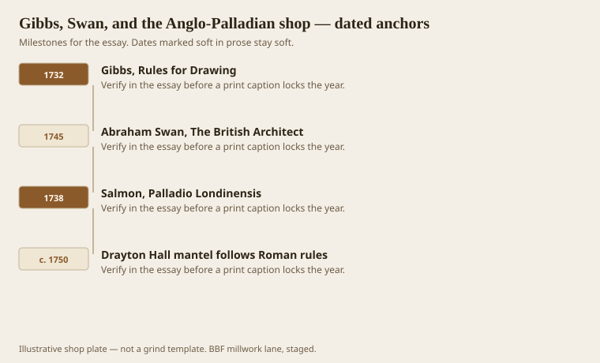
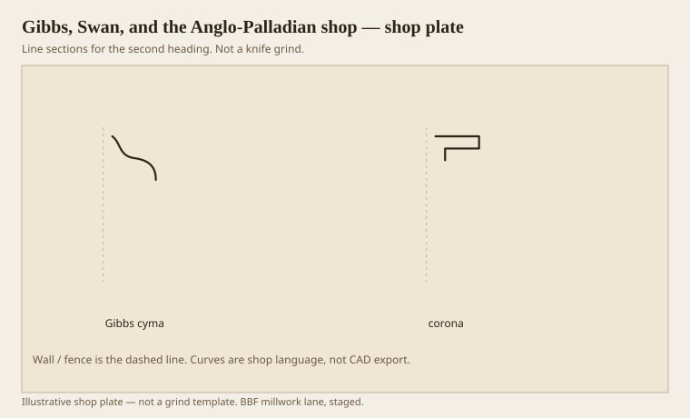

**Disclaimer.** Educational history and shop practice for the BBF millwork lane. Not a construction specification, not a bid, and not architectural or engineering advice. A measured opening and the local code beat a magazine essay.

The book that still sizes an American room is often English and Palladian, not Greek. James Gibbs’s *Rules for Drawing the Several Parts of Architecture* (1732) is a textbook of single-radius members and a way to draw an order without guessing. Abraham Swan’s *British Architect* (1745) put a Tuscan on the plate so a joiner could see that every curve had one center. William Salmon’s *Palladio Londinensis* (2nd ed. 1738) sat in John Drayton’s library while the mantels at Drayton Hall were being cut. Loth published the mantel next to the plate. The joiner was not “inspired.” He was following.

This is the shop culture the colonies actually had: compass, module, Roman circle. Greek quirks were still a generation away. If you are matching a 1750 Southern interior, do not sneak in an elliptical echinus because you like Benjamin’s 1806 plate. You are early.

## English plates in American tool chests

<!-- graphics-pack:v1 -->

*Figure 1. Gibbs, Swan, Salmon, and a Charleston mantel that did the homework.*

Gibbs matters for a second reason that has nothing to do with Charleston. Interior designers who still believe in cornices use his fractions — or the Classical Proportions tables derived from him — to pick a height from a ceiling. Method 1 (full order with pedestal) makes a smaller cornice, about 1/19 of the height on his Ionic. Method 3 (column on the floor) makes a larger one, about 1/15. Hierarchy between rooms is the point. A hall can be heavier than a bedroom. A drawing room can go the other way. The numbers are not laws. They are a way to stop buying the same 4-inch stick for every ceiling.

Swan’s Tuscan plate is the Roman lesson in one picture: cyma of two single-radius arcs, ovolo and cavetto in the bed, torus as a half-round, astragal as a half-round. If your “Georgian” crown has a Greek quirk, it is a later Georgian or a liar. Mid-Georgian Palladians, as the cornice essayists note, liked heavier interior cornices than the Victorians did. Heavy here means height and a real corona, not more scrolls.

Figure 1 includes Drayton because it is a measured American proof that the books were used. You do not need a plantation to use a book. You need a ceiling height and the humility to draw the order in the air before you pick a knife.

Colonial shops from Boston to the low country owned these plates the way a modern shop owns a worn AWI PDF: not for pleasure, for argument. When a client says “just something traditional,” Gibbs is a better answer than a rack of clamshell. Traditional, 1732, means Roman members in a coordinated height. Traditional, 2026 yard, means whatever is primed. Say which.

## Gibbs cornice fractions

<!-- graphics-pack:v1 -->

*Figure 2. A Gibbs-style cyma and corona. Height is a fraction of the room, not a SKU.*

Figure 2 is the interior object: a covering cyma and a corona with a soffit. The bedmould is implied. The lesson is the height. Take a 10-foot room (120 inches). Ionic, method 3, Gibbs-derived, is about 1/15.43 — call it 7-3/4 inches of cornice if you are not going to fight the table. Method 1 on the same order is nearer 6-1/4. That difference is visible. It is also the difference between “the room has a hat” and “the room has a line.” Chambers later said a simple interior cornice ought to sit between 1/15 and 1/20. A 3-5/8 stock crown in that 10-foot room is about 1/33. That is why it looks like a mistake even when the paint is perfect.

On the machine, a 7-3/4 built-up is three sticks or one fat grind. In a Southern shop I would rather run three: the cyma can be a stock knife you already own, the corona a ripped fascia with a rabbet, the bed a small ogee. You get a soffit. You get repairable parts. You do not have a 7-inch sprung monster that cups in August.

Gibbs will also keep you from putting a Corinthian dentil course in a room that cannot afford the order. Dentils are a bedmould enrichment. If the cornice is already undersized, dentils look like teeth on a thin face. Size first. Teeth later.

The Anglo-Palladian shop is the ancestor of every American millwork room that still believes in rules. Greek Revival is the cousin who came back from Athens and raised his voice. You need both in the file. For a 1740–1760 house, this is the file.
