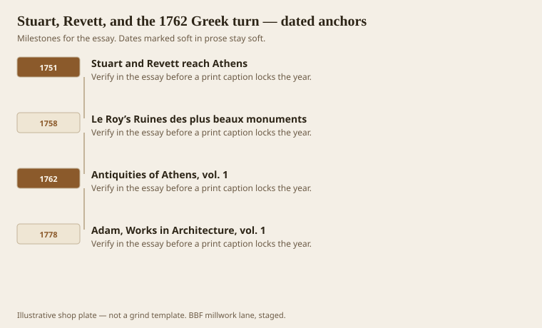
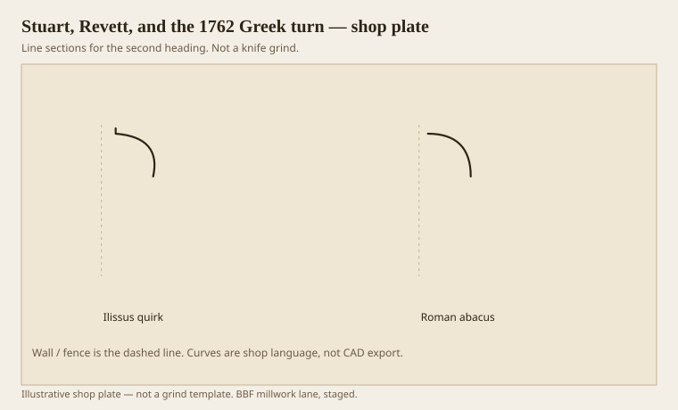

**Disclaimer.** Educational history and shop practice for the BBF millwork lane. Not a construction specification, not a bid, and not architectural or engineering advice. A measured opening and the local code beat a magazine essay.

James Stuart and Nicholas Revett went to Athens in 1751. The first volume of *The Antiquities of Athens* landed in 1762. That is a shop date, not only an art-history date. The plates of the little Ionic temple on the Ilissus — later destroyed; `[VERIFY]` the destruction note if you caption a ruin — showed an abacus that was not a straight slab. It was a quirked ovolo. An ellipse, a tuck, a hairline. English joiners who had spent their lives on Gibbs circles now had a second iron to grind.

Le Roy’s *Ruines* (1758) and Piranesi’s borrowings ran in the same decade. Adam, who worked with Piranesi on plates, said outright in 1778 that he preferred Greek curves and would bend them more for interiors. The Greek Revival in America is the loud child of this library. Benjamin and Lafever are the translators. This essay is about the parent book and the first shop consequences.

## A book that changed a plane iron

<!-- graphics-pack:v1 -->

*Figure 1. Athens fieldwork, Le Roy, the 1762 volume, and Adam’s published preference.*

A plane iron is a small thing to change after a war of plates, but that is how style arrives in wood. A quirked ovolo needs a different hollow. A Greek cyma is not two compass swings. Country carpenters in New England and Virginia did not all own *The Antiquities*. They owned Benjamin and Lafever, who had owned Stuart and Revett, or said they had. Lafever’s 1833 preface names the London volumes as the source for the ancient orders. That is a chain of custody. If you skip it, you will date a mantel by vibe.

Adam is the fashionable middle. His interiors are not museum Greece. They are Greece run through a London drawing room and then bent again. A millwork shop asked to do “Adam” in a hotel corridor is being asked for fine scale, a quirk, and restraint on the corona height — not for a Doric cliff. “Greek Revival” in a county courthouse is the cliff. Do not price them as the same grind.

Figure 1 is short because the turn is short. A decade of books, then a century of knives. The Colonial Revival later tried to put the old irons back. Some houses wear both centuries in one stair hall. Match the flight you are standing on.

The Ilissus plates also taught a lesson about the abacus: it can be a moulding, not only a board. When an architect draws a “simple cap” on a pilaster and then asks why it looks cheap, check whether the cap is a slab. A quirked ovolo cap is still simple. It is not cheap. Cheap is a ripped 5/4 with a router round-over.

## Ilissus quirk against a Roman abacus

<!-- graphics-pack:v1 -->

*Figure 2. Quirked abacus thought against a straight Roman slab. The hairline is the news.*

Figure 2 is the news of 1762 in two lines. The Roman abacus is a fillet with thickness. The Greek one is a curve that tucks. On a wood pilaster in a dining room, that tuck is a 1/8-inch event. You will sand it off if you are sloppy. You will lose it in paint if the painter films it like a truck bumper. Tell the painter the quirk is the design. Painters are not the enemy. Unlabeled quirks are.

Grinding: the quirk is a thin inside corner. Side clearance, a sharp wheel, and a test stick in the same species. If the job is stain-grade walnut — we run walnut more as furniture cousins than as 400-foot base, but caps happen — the quirk will show every burn. Poplar, paint, and a crisp arris are the humane path for a long run of pilasters.

Adam’s line about softening objects near the eye is a finish-room sentence. Near the eye, a Roman quarter-round can look brutal, like a piece of pipe. A Greek curve looks like it was thought about. That is not mysticism. It is more radii. More radii means more grind time. Put it on the ticket.

Stuart and Revett did not imagine a sticker in Tauberbischofsheim or a CNC in a metal building east of Warren. They imagined plates that would keep a civilization from guessing. We still guess, but we can guess from their section instead of from a phone photo of a ruin at noon. Noon flattens quirks. Raking light tells the truth. Set the sample under a raking light before you call the grind done. 1762 is a long way to go to ignore the shadow.
