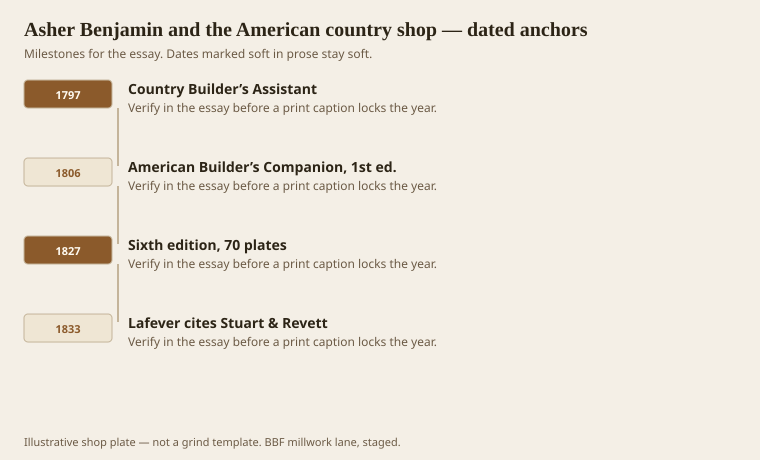
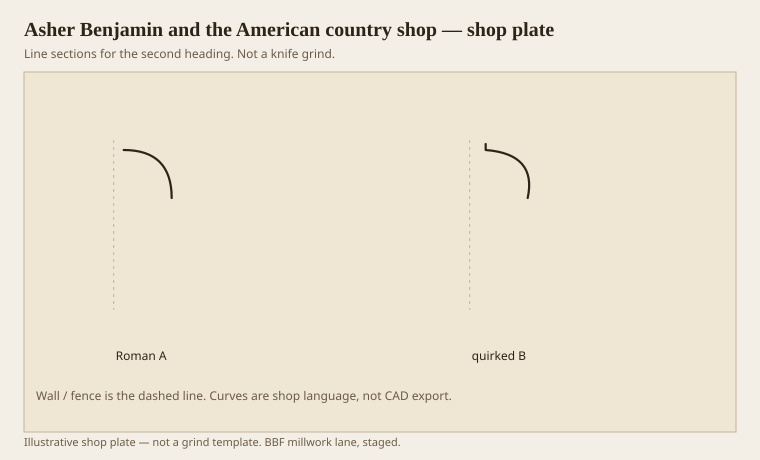
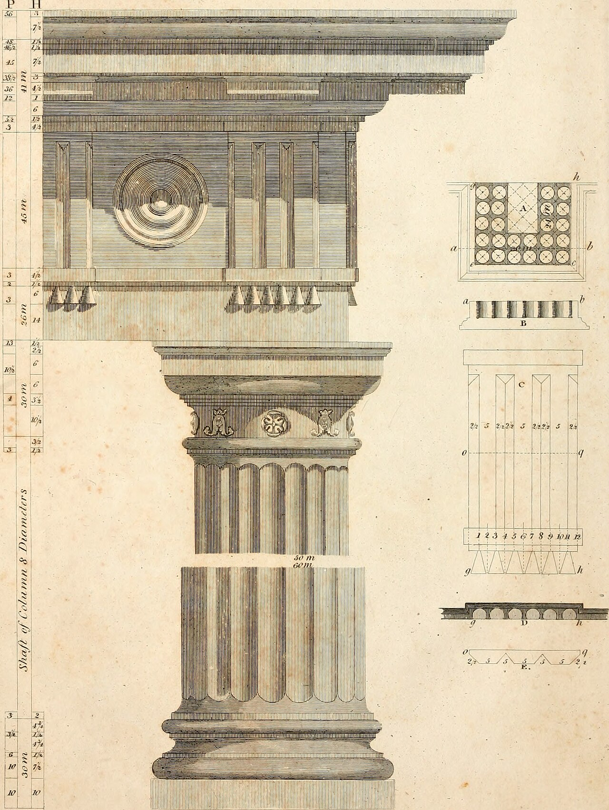

**Disclaimer.** Educational history and shop practice for the BBF millwork lane. Not a construction specification, not a bid, and not architectural or engineering advice. A measured opening and the local code beat a magazine essay.

Asher Benjamin (1773–1845) is the American millwork teacher who still feels like a shop boss. The 1797 *Country Builder’s Assistant* — Greenfield, copperplates, “the best methods for striking regular and quirked mouldings” — is a how-to, not a Grand Tour. The *American Builder’s Companion* (1806, then through a sixth edition in 1827 with seventy plates) is the book you can still argue with on a bench. He names the eight. He assigns jobs. He prefers the Greek quirk and then shows you, with a dotted line, why a lighter cornice can look nearly as tall as a heavier one at forty-five degrees.

He is not Palladio. He is the man who thought a joiner in a wooden republic should not have to guess. That is closer to a Warren ticket than a Vicenza villa. We use him as a desk copy, not as a saint.

## Greenfield plates for a wooden republic

<!-- graphics-pack:v1 -->

<figure class="millwork-figure">

<figcaption>Figure 1. Country Builder’s Assistant through Lafever cites Stuart & Revett — see “Greenfield plates for a wooden republic.”</figcaption>
</figure>

The Assistant is the earlier, thinner tool. Regular and quirked. Thirty-seven plates in the early issues. `[VERIFY]` plate counts if you caption a specific edition; they move. The Companion is the system: geometry, Grecian and Roman mouldings, doors, cornices, a whole house language “adapted to the present style of building” in the United States. Present style, 1806, already means Greek is winning. Present style, 1827, means the plates have multiplied.

Lafever’s 1833 *Modern Builder’s Guide* is the next shift, more New York, more willing to stack arrises. Benjamin is clearer about water and about jobs. If I could put only one dead man in a millwork apprentice’s locker, it would be Benjamin. He will not let you treat a cavetto as a support. He will not let you forget that a scotia is there to make darkness.

Figure 1 is a working life. He dies in 1845 in Springfield. The plates keep circulating in reprints. Dover kept the Companion alive for late-20th-century shops that still believed in books. PDFs keep it alive now. A PDF is fine. A full-size print of the plate you are grinding from is better. Screens lie about radii.

Country, in his title, is not an insult. It means the builder is not in a London office. South Arkansas is country in that sense even when the job is a hotel package. You still have to strike a moulding without a flying site visit to the Parthenon. Benjamin assumed that. So do we.

## The 45-degree cornice experiment

<!-- graphics-pack:v1 -->

<figure class="millwork-figure">

<figcaption>Figure 2. Profile plate for “The 45-degree cornice experiment.” Line sections, not a grind.</figcaption>
</figure>

<!-- graphics-pack:v1 -->

<figure class="millwork-figure millwork-figure--historical">

<figcaption>Figure 3. Scan from Asher Benjamin, *The American Builder's Companion* (Boston, 6th ed., 1827). Public domain. Wikimedia Commons / Internet Archive.</figcaption>
</figure>

Figure 2 restates the 1806 experiment without pretending to be his copper. A Roman ovolo and a quirked ovolo, same conversation about height. He said a modern cornice two-thirds as tall as a Tuscan copied from Langley could look nearly as tall at forty-five degrees, and that you might save a fourth of the expense besides keeping wall height. `[VERIFY]` the fractions on the plate before you sell a “Benjamin two-thirds” as a number. The usable claim is: contrast buys apparent size. A timid, tall profile can look smaller than a shorter one with a quirk and a real soffit.

That is a quoting tool. A client who wants “bigger crown” often wants a darker line, not more inches. Show a sample with a quirk and a corona at 5-1/2 before you grind 8 inches of blob. Inches are lumber. Lines are design.

On the machine, Benjamin’s “strike” is a pair of hollows and rounds and a compass. Our strike is a profile grinder and a test stick. The mental motion is the same. Draw the radii. Do not invent a fair curve in the air and hope the wheel understood. Greek sections have several centers. Mark them. If the apprentice cannot find the centers on the full-size, the knife will be a story instead of a section.

Benjamin also knew fashion would move. He is already selling Greek in 1806 while the older men still have Roman irons. A shop that can grind both is a shop that can date a house. A shop that can grind only the WM quarter-round is a shop that makes every century into 1998. The Companion is how you refuse that flattening. Read a plate. Then cut.
