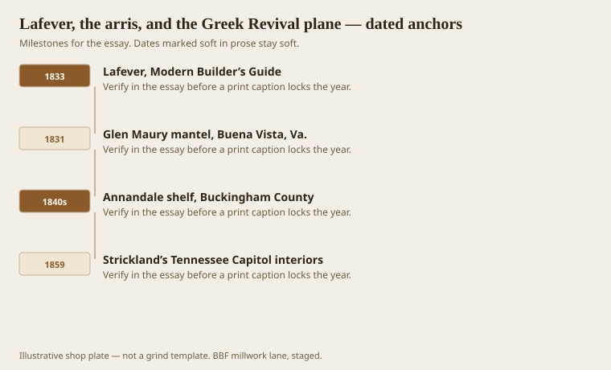
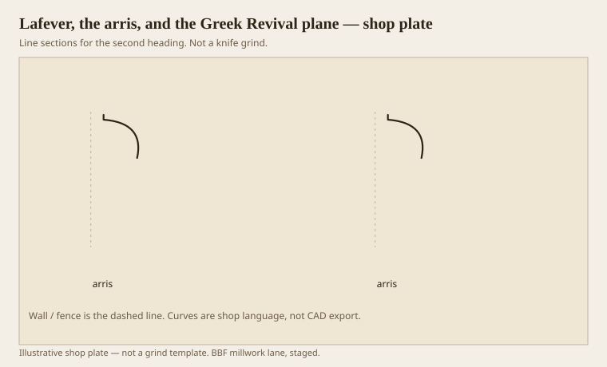

**Disclaimer.** Educational history and shop practice for the BBF millwork lane. Not a construction specification, not a bid, and not architectural or engineering advice. A measured opening and the local code beat a magazine essay.

Minard Lafever’s *Modern Builder’s Guide* (1833) is the loud American Greek book. He says in the preface that the ancient orders come from Stuart and Revett. Then he draws arrises under an echinus so a country carpenter can build a cliff out of quirks. Loth points at Glen Maury (1831, Buena Vista, Virginia) and at Annandale in Buckingham County: mantel shelves riding on stacked quirked ovolos, sharp as a new iron. It looks like a local genius overdid it. It is usually a plate.

Greek Revival is the first American style that asked ordinary shops for special blades. A Roman quarter-round was already in the chest. A quirked ovolo was a trip to the smith or a recut. That cost is why so much rural Greek work is assertive. If you are going to grind the iron, you are going to use it twice.

## New York plates, country houses

<!-- graphics-pack:v1 -->

*Figure 1. Lafever in print, Virginia mantels, and Strickland’s Nashville stone as the high-style cousin.*

Strickland’s Tennessee Capitol (done 1859) is the dressed version: stone piers with sharp ovolos and a quirk that reads as a dark thread. Wood shops copied the thread at mantel scale. The dates in Figure 1 overlap on purpose. The plates and the houses are a conversation, not a relay race. A farmhouse can be earlier than the book and still belong to the same iron.

Southern Greek Revival is not only columns on a porch. It is interior millwork that got crisper while the weather stayed wet. Paint helped. A lot of those quirks are paint-grade, and should stay paint-grade in a match. If a designer wants the Glen Maury cliff in stained walnut, smile and price the tearout. Walnut will do it. Walnut will also show every hesitation in the grind.

Lafever is less interested than Benjamin in the little lecture about water. He is interested in the look of Athens as a modern American fact. That makes him dangerous in a kitchen and useful in a parlor. A kitchen wants covering members that can take grease and a wipe. A parlor can take a cliff of arrises. Do not put the cliff over a range hood and call it history.

Figure 1 is also a warning about dating. 1830s wood and 1859 stone share a family. 1890 Colonial Revival does not. If the mantel was swapped in a 1920 remodel, the quirks may already be gone. Cookie the existing, do not cookie the book you wish they had owned.

## Stacked arrises under a shelf

<!-- graphics-pack:v1 -->

*Figure 2. Two quirked ovolos as a bedmould idea. The hairlines are the architecture.*

Figure 2 is the rural mantel thought: repeat the quirk until the shelf is a conclusion. In stone, Strickland can do it with one good ovolo. In wood, repetition is how you get projection without a giant solid. Each ovolo is a small knife. Stacked, they make a bedmould that throws a lot of line.

Shop practice: do not grind one wide knife that tries to be three ovolos unless the run is long enough to pay. Three passes, or three sticks glued, will match a historic cliff more honestly, because historic work was often stuck in pieces. A single wide grind will also cup as one board. Three sticks can move a little and still read as a stack.

The arris — the sharp line between planes or at the quirk — is the Greek Revival plane’s whole personality. Sand it for the painter and you have made Federal-ish mush. If the spec requires a safety radius (healthcare, childcare), you are not in Lafever anymore. Write that on the drawing. A 1/16 radius can keep a quirk if you start deep enough. A 1/8 radius eats it.

Plane, in the old sense, is the tool and the idea. A Greek Revival carpenter needed planes that could cut the tuck. We need knives that can. The mental tool is the same: do not fair away the thing you came to cut. Lafever borrowed Athens. The shop’s job is not to borrow Athens again. It is to cut the section the house already filed.
