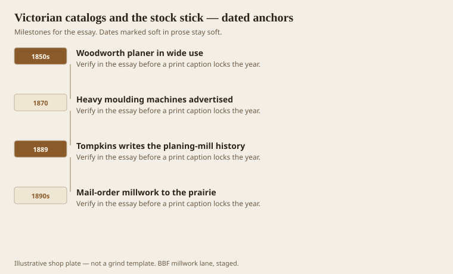
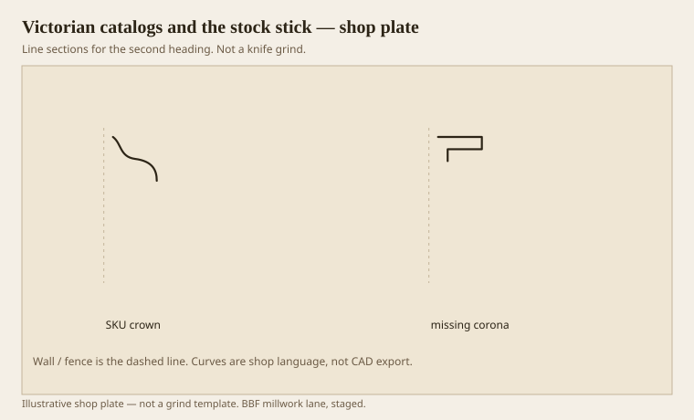

**Disclaimer.** Educational history and shop practice for the BBF millwork lane. Not a construction specification, not a bid, and not architectural or engineering advice. A measured opening and the local code beat a magazine essay.

The 19th century did not kill hand moulding. It made it a specialty. Woodworth’s planer (patent 1828, then a long, ugly patent war) put surfaced lumber in reach. Heavy moulding machines — Fay & Fisher get the early credit around 1870; Rogers, S. A. Woods, H. B. Smith, C. R. Tompkins’s whole cast — put a repeating section on a feed roll. Tompkins, writing the planing-mill history in 1889, said architects got more exacting because they could. He also said mouldings stuck now were not the mouldings stuck a few years back. Fashion and the machine moved together.

A catalog number is a machine’s memory. Once a profile is a SKU, a shop in Chicago and a shop in Little Rock can sell the same wave. That is a gift if you are building a thousand prairie houses. It is a problem if you are matching a hand-struck 1840 quirk. The SKU won most of the rooms. This essay is about that win.

## When a profile became a SKU

<!-- graphics-pack:v1 -->

*Figure 1. Planer, heavy moulder, Tompkins’s book, and mail-order millwork riding the rails.*

Mail-order millwork is the last hook in Figure 1. By the 1890s a house on the prairie could have a spindle porch and a boxed cornice that never saw a local joiner’s plane. The sticks rode in mixed cars — the same language Bradley Lumber used on a postcard: mixed car headquarters, pine millwork, furniture stock. A Southern mill town was not only logs. It was a factory that could load trim.

Tompkins is worth reading even if you never touch a line shaft. He treats the moulder as a machine that demands a better mechanic, not a worse one. That is still true. A sticker with a bad grind will make a mile of expensive firewood. Hand work hides a bad day in one door. A machine publishes your bad day.

Victorian taste, in interiors, often used a smaller cornice than the mid-Georgians, then spent the money on wallpaper, spindles, and a busy mantel. The cornice shrank. The catalog made the shrink easy. You can still build a Victorian room with a proper three-part cornice. Many did. The stock stick made it optional. Optional is how a corona disappears.

Figure 1 is industrial on purpose. This is not a style essay about Eastlake vs Queen Anne. Those are real. The shop fact underneath is the SKU. Once the number exists, the argument with the architect becomes “which number,” not “which job is this member doing.” We still have to ask the second question. The catalog will not.

## Catalog crown against a built-up

<!-- graphics-pack:v1 -->

*Figure 2. A one-piece catalog wave beside the corona it usually forgot.*

Figure 2 is the visual of the century. Left, a sprung wave that tries to be a whole entablature. Right, a corona — the flat with a soffit — that the wave omitted. You can buy both in a yard if you look. Most tickets buy the wave. The room looks thinner than the money.

A Victorian catalog also sold Gothic, Swiss, and “Grecian” as if they were paint colors. Some profiles are good. The names are a mess. When a restoration carpenter hands you a page, ignore the poetry and cookie the section. If the page and the house disagree, the house wins. Catalogs lie the way websites lie: they flatten depth.

Machine note: a heavy inside moulder of the 1870s is the ancestor of the four-side we still mean when we say sticker. Side heads, chipbreakers (Tarr and others patented those to stop slivering), a bed that could be gibbed. The modern Weinig is a later German sentence in the same paragraph. Do not tell a 19th-century story as if Tauberbischofsheim invented the stick. America ran miles of moulding before Unimat.

For this lane, the catalog century is also the mill-town century. Flooring, furniture stock, pine trim, oak. The SKU did not come from a design studio. It came from a planer mill that had to fill a car. Understanding that keeps you from sneering at stock. Stock is how ordinary rooms got any shadow at all. Sneer at the missing corona, not at the fact of a number. Then, when the job can pay, put the corona back.
