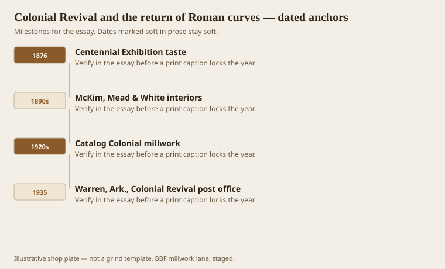
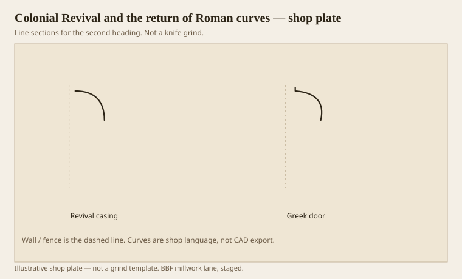

**Disclaimer.** Educational history and shop practice for the BBF millwork lane. Not a construction specification, not a bid, and not architectural or engineering advice. A measured opening and the local code beat a magazine essay.

Colonial Revival is the undo button on Greek quirks. Loth says it straight: early 20th-century taste brought Roman mouldings back in imitation of 18th-century practice. The Centennial in 1876 started the mood. McKim, Mead & White made it expensive and good. Catalogs made it cheap and everywhere. A quarter-round is easy. A quirk is a special grind. Taste and the grind shop agreed for once.

“Colonial” on a 1924 door is not 1750. It is 1924 remembering 1750 with a machine and a thinner wallet. Sometimes the memory is excellent. Sometimes it is a clamshell and a plinth block from a different book. Matching a Revival house means matching 1924, not punishing the house for not being Drayton Hall.

Warren’s 1935–36 post office, Louis A. Simon for the Treasury, is Colonial Revival in a mill town that had spent thirty years cutting oak and pine. The style sat on Main Street while the mills sat on the edge of town. That is the American split: the civic face goes Roman-colonial, the sheds stay industrial. Both are millwork stories.

## A fashion that flattened the quirk

<!-- graphics-pack:v1 -->

*Figure 1. Centennial taste, the big offices, catalog Colonial, and a Treasury post office in Warren.*

Figure 1 is civic on purpose. Revival is a public language. It is also a kitchen language: six-panel doors, a small ogee backband, a base with a torus-ish cap. The quirked Greek mantel in the parlor — if the house is 1840 — may have been left alone while the 1920s added a Colonial stair. Two centuries, one address. Cookie each room.

McKim’s offices could afford to be scholarly. They looked at 18th-century sections and had them remade. A tract house in 1928 bought a catalog page that said Colonial and meant “single-radius, paint-grade, we have it in 16-footers.” Both are Revival. Only one is a measured memory. Do not grind the tract house as if Stanford White had the pen. Do not grind a White interior as if it were a tract house. The word Colonial will not save you.

Flattening the quirk was also a paint decision. Early 20th-century enamel likes a rounder arris. A hairline quirk is a dirt trap in a kitchen and a pride in a dining room. Revival kitchens often eased what parlors kept. If you are matching, follow the room, not the brand.

The Warren post office date is from the 2012 AHPP walk. `[VERIFY]` if a caption needs the supervising-architect spelling. The point is local: even a hardwood town dressed its federal building in the Roman-colonial suit. Millwork follows the suit.

## Revival casing against a Greek door

<!-- graphics-pack:v1 -->

*Figure 2. A calm Revival casing section beside a leftover Greek door thought.*

Figure 2 is the mismatch you will find in remuddled houses. A 1920s casing — stepped fillets and a Roman ovolo — next to an 1840 door that still wants a quirked cap. You can keep both. You should not average them into a third profile that belongs to no year. Averaging is how “transitional” becomes a crime scene.

Shop: Revival casings are often backbanded. The backband is how a thin inner moulding grows without looking like a bandage. Greek Revival ears (shoulders, crossettes) are a different grow. Do not put ears on a 1930 clamshell and call it a restoration. Put ears on the 1835 door that lost them.

On the moulder, Revival work is a rest. Single radii, generous lands, paint-grade poplar or FJ pine. The danger is boredom. Boredom is not a reason to sneak a quirk onto a 1938 bungalow. If the owner wants more life, add a proper three-part cornice at Gibbs’s fraction. That is 18th-century memory without lying about the door.

Colonial Revival is not the enemy of this pack. It is the reason most Americans think “traditional” means a quarter-round. Teach the difference, then cut what the house filed. If the house filed 1928, cut 1928. Benjamin will forgive you. He wrote for the present style of his own year. So should we, once we know which year we are in.
